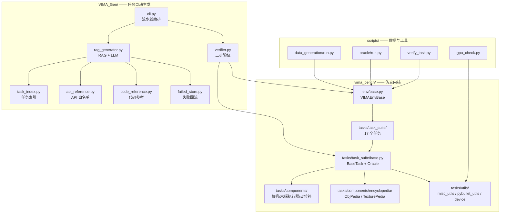
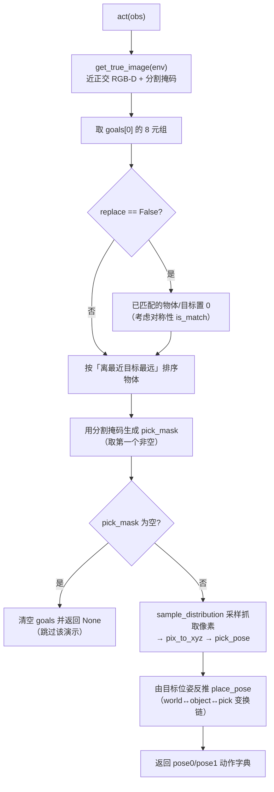
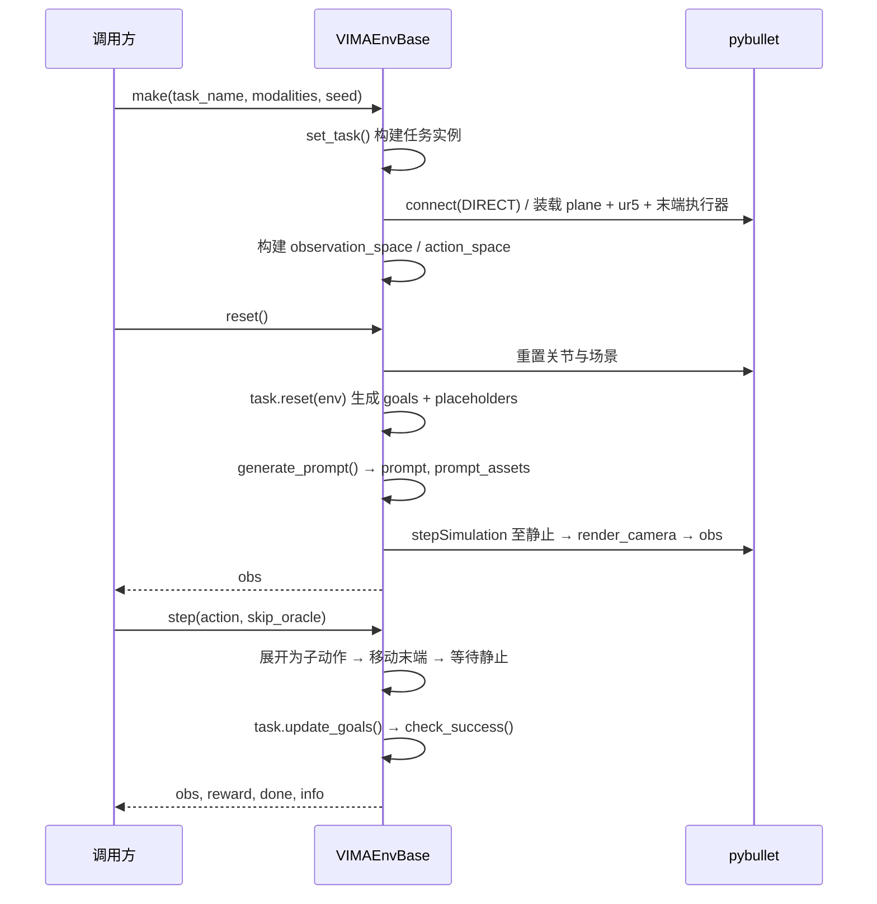
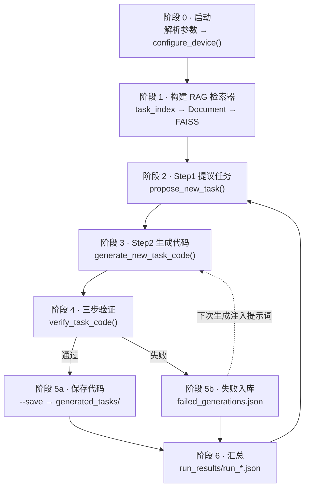
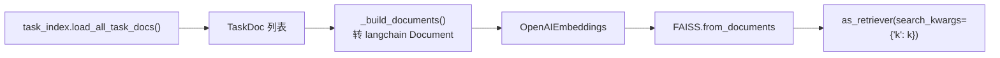
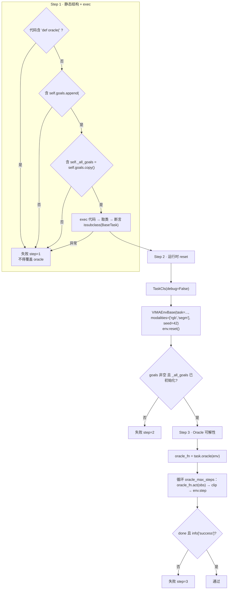
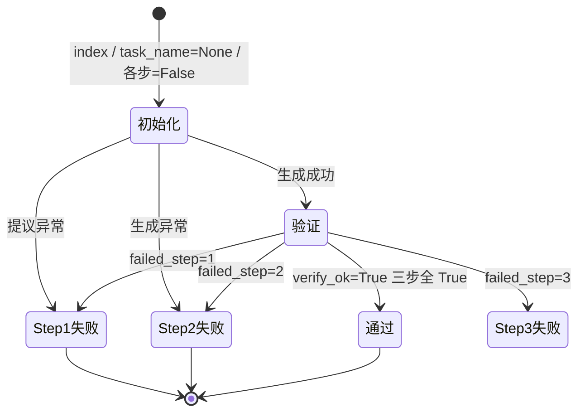
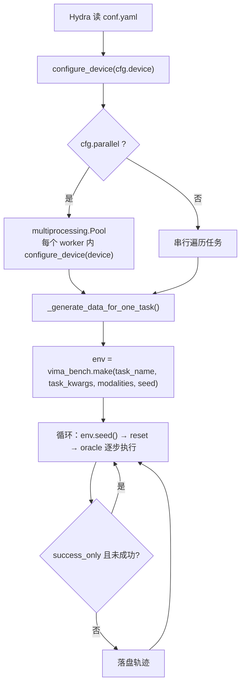

# VIMA_Gen 全流程解析

> 本文档逐层拆解 `VIMA_Gen` 仓库：从环境依赖、`vima_bench` 仿真内核，到 RAG 任务生成流水线、
> 三步验证器、数据生成脚本，以及 GPU 运行方式。
>
> 文档基准：`main` 分支（commit `f46c96c`），运行环境 `.venv` = Python 3.10.21 + PyTorch 2.14.0+cu130。
> 文中所有「实测」数据均在本机（RTX 5060 Laptop 8 GiB）验证过。

---

## 目录

1. [项目定位与整体架构](#1-项目定位与整体架构)
2. [目录与模块职责](#2-目录与模块职责)
3. [运行环境与依赖](#3-运行环境与依赖)
4. [核心抽象：vima_bench 内核](#4-核心抽象vima_bench-内核)
5. [VIMA_Gen 生成流水线全流程](#5-vima_gen-生成流水线全流程)
6. [支撑模块详解](#6-支撑模块详解)
7. [数据生成与 Oracle 脚本流程](#7-数据生成与-oracle-脚本流程)
8. [GPU 运行](#8-gpu-运行)
9. [端到端运行手册](#9-端到端运行手册)
10. [本次改动清单](#10-本次改动清单)
11. [已知问题与风险](#11-已知问题与风险)
12. [附录：关键文件与符号索引](#12-附录关键文件与符号索引)

---

## 1. 项目定位与整体架构

`VIMA_Gen` 是 `VIMA-Bench` 的**任务自动生成工具箱**：用 LLM 在已有任务的基础上提出新任务，
生成可执行的 `BaseTask` 子类代码，并**自动验证**其可运行性与 oracle 可解性。

整个仓库可以分成三层，职责边界清晰：

| 层 | 位置 | 职责 |
|---|---|---|
| **仿真内核** | `vima_bench/` | pybullet 物理环境、17 个内置任务、任务基类与 oracle、物体/纹理百科、相机 |
| **生成流水线** | `VIMA_Gen/` | RAG 检索、LLM 提议与编码、三步验证、失败回流、结果落盘 |
| **数据脚本** | `scripts/` | 用 oracle 批量生成演示数据、单任务验证、GPU 自检 |



**核心设计取舍**

- **白名单式 API 约束**：`api_reference.py` + `code_reference.py` 把可用导入、`ObjPedia`/`TexturePedia`
  条目、`BaseTask` 关键方法签名硬编码进提示词，显著降低「幻觉导入」。
- **结构化骨架**：提示词里给出必须遵守的 `goals.append(...)` 与 `self._all_goals = self.goals.copy()`
  骨架，并在验证 Step 1 做静态检查。
- **失败回流**：验证失败的代码与报错写入 `failed_generations.json`，下次生成时注入提示词。
- **不覆盖 oracle**：禁止生成代码自定义 `oracle()`，统一继承 `BaseTask.oracle`。

---

## 2. 目录与模块职责

### 2.1 `VIMA_Gen/`（生成流水线）

| 文件 | 职责 |
|---|---|
| `cli.py` | 主入口。解析参数 → 解析设备 → 构建检索器 → 对 `n` 个候选循环执行 Step1/Step2/验证 → 保存 → 写摘要 |
| `rag_generator.py` | FAISS 检索器构建、Step1 提示词与解析、Step2 提示词（含骨架/API 参考/失败注入）与代码抽取 |
| `task_index.py` | 把 17 个内置任务 + `generated_tasks/*.py` 统一成 `TaskDoc`，供检索 |
| `api_reference.py` | 生成「允许导入 + 百科条目」文本，明确禁止错误路径 |
| `code_reference.py` | 摘录 `BaseTask` 关键方法、`pybullet_utils`、`misc_utils`、`PlaceholderObj` 用法 |
| `verifier.py` | 三步验证 + 调试产物落盘（`verifier_debug/`） |
| `failed_store.py` | 失败样本持久化与提示词格式化 |
| `failed_generations.json` | 失败样本池（运行期生成） |
| `run_results/run_*.json` | 每次运行的验证摘要（运行期生成） |
| `generated_tasks/*.py` | 通过验证并被 `--save` 保存的任务代码（运行期生成） |

### 2.2 `vima_bench/`（仿真内核）

| 路径 | 职责 |
|---|---|
| `__init__.py` | `make()` 工厂；导出 `ALL_TASKS` / `ALL_PARTITIONS` / `PARTITION_TO_SPECS` 与设备 API |
| `env/base.py` | `VIMAEnvBase`：pybullet 连接、场景装载、相机渲染、`reset`/`step`/`oracle_step` |
| `env/wrappers/` | `PromptRenderer`（多模态提示词拼图）、`GUIRecorder`（GUI 录屏） |
| `tasks/__init__.py` | 汇总 `ALL_TASKS`，加载 5 个分区 YAML |
| `tasks/task_suite/base.py` | `BaseTask`：占位符、目标（goals）、oracle、`get_true_image`、随机位姿采样 |
| `tasks/task_suite/<group>/` | 7 个任务族、共 17 个任务 |
| `tasks/components/` | 相机（`NearPerfectCamera128x256`）、末端执行器（`Suction`/`Spatula`）、动作原语（`PickPlace`）、占位符 |
| `tasks/components/encyclopedia/` | `ObjPedia` / `TexturePedia` / `ProfilePedia` 百科条目 |
| `tasks/utils/` | `misc_utils`（高度图/点云/图像）、`pybullet_utils`（装载/上色）、`device.py`（设备管理） |
| `tasks/partition_files/` | 训练集 + 4 个泛化测试分区 YAML |
| `tasks/assets/` | URDF / OBJ 网格 / 纹理 |

### 2.3 `scripts/`

| 文件 | 职责 |
|---|---|
| `data_generation/run.py` | Hydra 驱动，用 oracle 批量生成成功演示轨迹并落盘（含并行） |
| `data_generation/conf.yaml` | 数据生成配置 |
| `oracle/run.py` | 单任务 oracle 回放（带 GUI 窗口），用于调试 |
| `oracle/task/*.yaml` | 每个任务的 `task_kwargs` 预设 |
| `verify_task.py` | 轻量验证：仅 `reset()`，或跑 `--oracle` 若干 episode |
| `gpu_check.py` | GPU 自检：设备解析、kornia GPU 吞吐、pybullet 渲染器报告 |
| `data_loading.py` | 读取生成数据的示例 |

---

## 3. 运行环境与依赖

### 3.1 环境事实

| 项 | 值 |
|---|---|
| 虚拟环境 | `.venv/`（Python **3.10.21**，由 `uv` 下载的独立 CPython） |
| 体积 | 约 6.3 GB（含 CUDA 版 PyTorch） |
| PyTorch | `2.14.0+cu130`，CUDA build 13.0 |
| GPU | NVIDIA GeForce RTX 5060 Laptop，8 GiB，compute capability 12.0 |
| 驱动 | 610.88 |

> **为什么必须是 3.10？** `pybullet` 没有 `cp314` wheel 且本机无 C/C++ 编译器，`gym==0.21.0` 也无法在
> 3.14 安装。系统仅有 Python 3.14，因此用 `uv` 拉取独立 3.10 解释器重建 `.venv`。

### 3.2 `requirements.txt`（24 项，已补全）

```
# ---- VIMA-Bench core ----
pybullet          gym==0.21.0       einops        dm-tree       numpy
torch             torchvision       psutil        opencv-python matplotlib
imageio           transforms3d      kornia        hydra-core    omegaconf
tqdm              av                importlib_resources         black

# ---- VIMA_Gen: RAG + LLM ----
langchain-openai  langchain-community  langchain-core  faiss-cpu

# ---- image utilities ----
Pillow
```

其中 `numpy` / `omegaconf` / `langchain-core` / `langchain-community` / `faiss-cpu` / `Pillow`
是本次补齐的缺失依赖；`langchain` 本身不再需要（代码已改用 `langchain_core`）。

`setup.py` 通过 `pkg_resources.parse_requirements` 读取该文件，注释行与空行均可安全解析。

### 3.3 设备解析优先级

```
显式参数（--device） > 环境变量 VIMA_DEVICE > 自动（有 CUDA 则 cuda:0，否则 cpu）
```

### 3.4 配置体系（`.env` + `config.yaml`）

运行参数与密钥全部从代码里抽出，分两处存放：

| 文件 | 内容 | 是否入库 |
|---|---|---|
| `.env`（项目根） | **密钥与接口**：`OPENAI_API_KEY`、`OPENAI_BASE_URL`、模型名、设备 | ❌ 已被 `.gitignore` 忽略 |
| `.env_example`（项目根） | 同结构模板 + 注释与示例值，供他人 `cp` | ✅ 入库 |
| `VIMA_Gen/config.yaml` | **非敏感运行参数**：`n` / `k` / `brief` / `save` / 输出路径 / `device` | ✅ 入库 |
| `VIMA_Gen/settings.py` | 加载与优先级合并逻辑 | ✅ 入库 |
| `VIMA_Gen/embeddings.py` | 嵌入后端实现（本地 `sentence-transformers` / OpenAI 兼容） | ✅ 入库 |

**优先级**（高 → 低）：

```text
CLI 参数  >  .env / shell 环境变量  >  VIMA_Gen/config.yaml  >  settings.py 内置默认值
```

**支持的环境变量**

| 变量 | 作用 | 默认 |
|---|---|---|
| `OPENAI_API_KEY` | API 密钥（必填） | 无；缺失时给出 `cp .env_example .env` 的可操作报错 |
| `OPENAI_BASE_URL` | 自建 / 代理网关地址 | 空 = 官方 `https://api.openai.com/v1` |
| `VIMA_LLM_MODEL` | 对话模型（Step1 / Step2） | `gpt-4.1-mini` |
| `VIMA_EMBEDDING_PROVIDER` | 嵌入后端：`local` / `openai` | `local` |
| `VIMA_LOCAL_EMBEDDING_MODEL` | `provider=local` 时的 HF 模型 id | `sentence-transformers/all-MiniLM-L6-v2` |
| `VIMA_EMBEDDING_MODEL` | `provider=openai` 时的嵌入模型 | `text-embedding-3-small` |
| `VIMA_EMBEDDING_BASE_URL` | `provider=openai` 时的**独立**接口地址 | 无（必须显式配置） |
| `VIMA_EMBEDDING_API_KEY` | `provider=openai` 时的**独立** key | 无（必须显式配置） |
| `VIMA_TEMPERATURE` | 采样温度 | `0.7` |
| `VIMA_DEVICE` | 运行设备 | `auto` |

`.env` 查找顺序为 `<项目根>/.env` → `<项目根>/VIMA_Gen/.env`，且**不覆盖**已存在的 shell 环境变量。

#### 为什么嵌入后端与 chat 分离

不少 OpenAI 兼容网关**只提供 chat，不提供 `/embeddings`** —— 例如 DeepSeek 的
`/embeddings` 会返回 **404**。若沿用 chat 的 key/base_url 去请求嵌入，流水线会在
`build_retriever()` 阶段（**任何 chat 调用之前**）直接崩掉。

因此嵌入后端独立成 `EmbeddingConfig`：

- **`provider: local`（默认）** —— 用 `sentence-transformers` 离线编码，自动跑在
  `get_device()` 解析出的设备上（有 CUDA 用 GPU）。**整个流水线只需一个 chat key**，
  且首次下载后完全离线。
- **`provider: openai`** —— 指向任意提供 `/embeddings` 的服务，需要单独配置
  `VIMA_EMBEDDING_BASE_URL` / `VIMA_EMBEDDING_API_KEY`（缺失时给出明确报错而非 401）。

对应实现：`VIMA_Gen/embeddings.py::LocalSentenceTransformerEmbeddings`，
由 `rag_generator._embedding_model()` 按配置构造。

**落地链路**：`settings.load_config()` 产出 `RunConfig`（内含 `LLMConfig`）；`cli.py` 用 CLI 参数覆盖后，
把 `cfg.llm` 传给 `build_retriever` / `propose_new_task` / `generate_new_task_code`；
后者通过 `LLMConfig.chat_kwargs()` / `embedding_kwargs()` 构造

```python
ChatOpenAI(model_name=..., temperature=..., openai_api_base=..., openai_api_key=...)
OpenAIEmbeddings(model=..., openai_api_base=..., openai_api_key=...)
```

> 字段名刻意使用 langchain-openai 的 **pydantic 字段名**（`model_name` / `openai_api_base` /
> `openai_api_key`）而非别名（`model` / `base_url` / `api_key`），避免版本间别名差异带来的坑。

运行时容器会打印一行**不含密钥**的摘要，便于确认实际生效的配置：

```text
[RAG] 配置：model=cli-model | embedding=text-embedding-3-small | temperature=0.3 |
            base_url=https://gw.example/v1 | api_key=set | n=3 | k=2 | save=True | device=cpu
```

---

## 4. 核心抽象：vima_bench 内核

### 4.1 `BaseTask` 关键属性

`BaseTask.__init__` 接收 `prompt_template` / `task_meta` / `placeholder_expression` / `oracle_max_steps`
等参数，并初始化一批任务级状态：

| 属性 | 默认值 | 说明 |
|---|---|---|
| `oracle_max_steps` | 由子类指定 | oracle 允许的最大步数 |
| `oracle_step_to_env_step_ratio` | `4` | 一个 oracle 步展开成几个 env 子动作 |
| `difficulties` | `["easy","medium","hard"]` | 评估难度档位 |
| `ee` / `primitive` | `Suction` / `PickPlace()` | 末端执行器与动作原语 |
| `oracle_cams` | `Oracle.CONFIG` | oracle 专用近正交相机 |
| `pos_eps` / `rot_eps` | `0.01` / `15°` | pose 匹配容差 |
| `bounds` / `pix_size` | `[[0.25,0.75],[-0.5,0.5],[0,0.3]]` / `0.003125` | 工作空间与像素尺度 |
| `goals` | `[]` | 目标序列（见下） |
| `placeholders` | `{}` | 提示词占位符 → 实际资产 |
| `_all_goals` | `None` | `goals` 的初始快照，用于判断「是否移动过干扰物」等 |
| `rng` | `np.random.default_rng(seed)` | 任务随机源（与 env 随机源独立） |

### 4.2 `goals` 8 元组语义

`BaseTask` 中每个 goal 是 8 元组：

```python
objs, matches, targs, replace, rotations, metric, params, max_reward = goal
```

| 字段 | 含义 |
|---|---|
| `objs` | `[(obj_id, (symmetry, extra)), ...]` 待操作的物体 |
| `matches` | `0/1` 矩阵，`matches[i, j]=1` 表示第 `i` 个物体可匹配第 `j` 个目标 |
| `targs` | `[(pos, quat), ...]` 目标位姿 |
| `replace` | 是否允许重复匹配（`False` 时一个目标只能被占用一次） |
| `rotations` | 是否评估/施加末端旋转 |
| `metric` | 匹配度量（如 `"pose"`） |
| `params` | 附加参数；`params["oracle_only"] = True` 表示该 goal 仅 oracle 关心 |
| `max_reward` | 该 goal 的进度权重 |

`reset()` 结束前必须执行 `self._all_goals = self.goals.copy()`——这也是验证器 Step 1 的硬性检查项。

### 4.3 `oracle()` 工作原理

`BaseTask.oracle(env)` 返回一个 `OracleAgent(act)`，`act(obs)` 的决策流程：



关键点：

- **oracle 使用特权信息**：`get_true_image` 走 `oracle_cams`，是近正交、无噪声的 RGB-D + 分割图，
  经 `reconstruct_heightmaps` 重建为高度图，供 `pix_to_xyz` 做像素→三维反投影。
- **旋转处理**：`sixdof=False` 时把目标与物体的姿态归约到绕 z 轴，再按 `rotations` 决定是否保留。
- **动作裁剪**：调用方（验证器、数据生成、oracle 脚本）统一按 `env.action_space[k]` 做 `np.clip`。

### 4.4 `VIMAEnvBase` 运行时



要点：

- **动作空间**：`pose0_position (2,)` / `pose0_rotation (4,)` / `pose1_position (2,)` /
  `pose1_rotation (4,)`，位置边界为 `x∈[0.25,0.75]`、`y∈[-0.5,0.5]`。
- **观测空间**：按 `modalities` 组装（`rgb` / `segm`；`depth` 被显式断言禁用，代码中留有
  `FIXME: fix depth normalization`），再附加 `ee` 维度。
- **`reset()` 的强校验**：`obj_id_reverse_mapping` 必须覆盖所有 `obj_ids`，否则直接断言失败——
  这是新任务最容易踩的坑。
- **渲染**：`render_camera()` 走 `p.getCameraImage`，`renderer` 由 `device.py::pybullet_renderer()`
  决定（默认硬件 OpenGL，可切到 CPU 光栅化）。

### 4.5 17 个内置任务

| 任务族 | 任务 |
|---|---|
| `instruction_following` | `rotate`, `scene_understanding`, `visual_manipulation` |
| `constraint_satisfaction` | `sweep_without_exceeding`, `sweep_without_touching` |
| `novel_concept_grounding` | `novel_adj`, `novel_adj_and_noun`, `novel_noun`, `twist` |
| `one_shot_imitation` | `follow_motion`, `follow_order` |
| `rearrangement` | `rearrange` |
| `require_memory` | `manipulate_old_neighbor`, `pick_in_order_then_restore`, `rearrange_then_restore` |
| `require_reasoning` | `same_shape`, `same_texture` |

**分区**：`train`（13 个任务）+ 4 个泛化测试分区
（`placement_generalization` / `combinatorial_generalization` /
`novel_object_generalization` / `novel_task_generalization`），由 `PARTITION_TO_SPECS` 暴露。

---

## 5. VIMA_Gen 生成流水线全流程

### 5.1 总览



外层循环由 `--n` 控制：每个候选独立走 Step1 → Step2 → 验证，单个候选失败不会中断整轮运行。

### 5.2 阶段 0 · 启动与设备解析

`cli.py`：

1. `os.environ.setdefault("KMP_DUPLICATE_LIB_OK", "TRUE")` —— 规避 OpenMP 重复加载崩溃。
2. `argparse` 解析 `--brief / --n / --k / --save / --model / --temperature / --device`。
3. `configure_device(args.device)` —— 解析并启用设备，打印
   `[VIMA][device] torch=... | cuda_available=True | device=cuda:0 | name='...' | cc=... | mem=...`。
4. 读取 `api_reference` 文本与历史失败文本（各一次，循环内复用）。

> 注意：`rag_generator` / `api_reference` / `task_index` 都依赖 `verifier` 在导入时把**项目根目录**
> 插入 `sys.path`，因此 `cli.py` 必须从 `VIMA_Gen/` 目录下运行（见 §9）。

### 5.3 阶段 1 · 构建 RAG 检索器



- **内置任务**：对每个 `ALL_TASKS` 条目 `inspect.getsource(cls)` + `getdoc(cls)`，组装
  `[BUILTIN TASK] {group}/{task_name}`、模块名、docstring、完整源码。
- **已生成任务**：扫描 `VIMA_Gen/generated_tasks/*.py`，按 `# group:` 注释、`task_name = "..."`、
  `class X(` 正则推断元数据。
  **重要**：已生成任务只作为文本参与检索，**不会**注册进 `ALL_TASKS`。
- 元数据字段：`id` / `origin`(builtin|generated) / `group` / `task_name` / `class_name` / `module`。

### 5.4 阶段 2 · Step 1：提出新任务

`propose_new_task(retriever, model_name, temperature, hint_brief)`：

- **System 提示**：要求任务名唯一（snake_case）、一句话描述、并归属 7 个任务族之一。
- **User 提示**：拼接全部内置任务名与首行描述 + 可选的 `--brief` 提示。
- **输出格式**（严格文本，非 JSON）：

  ```
  TASK_NAME: <snake_case_name>
  GROUP: <one of the groups>
  TASK_DESCRIPTION: <one or two sentences>
  ```

- **解析**：按行前缀匹配 `TASK_NAME:` / `GROUP:` / `TASK_DESCRIPTION:`；
  缺 `task_name` 时回退 `"generated_task"`，缺描述时截取回复前 200 字符。
- 检索器在此函数中实际**未被使用**（仅签名保留），去重靠把完整内置任务清单塞进提示词。

### 5.5 阶段 3 · Step 2：生成任务代码

`generate_new_task_code(...)` 组装的提示词包含四块：

1. **API 参考**（`api_reference.get_api_reference_text()`）
   - 允许的导入白名单：`BaseTask`、`ObjPedia`/`TexturePedia`、`definitions`、
     `placeholders`、`pybullet_utils` 的 4 个函数、`misc_utils as utils`、`numpy`、`pybullet`。
   - 现存 `ObjPedia` / `TexturePedia` 条目名清单（防止臆造）。
   - 明确禁止：`vima_bench.utils.obj_pedia`、`vima_bench.utils.tex_pedia`、
     `vima_bench.utils.pybullet_utils`（这些路径**不存在**）。
   - 附 `code_reference` 摘录（`add_object_to_env` 完整签名、`get_random_pose`、`is_match`、
     `get_random_size`、属性说明等）。
2. **必须遵守的骨架**：`__init__` / `reset` / `check_success` 三段式，含
   `self.goals.append((...))` 与 `self._all_goals = self.goals.copy()`。
3. **反平凡化要求**：`reset()` 里采样位姿后必须检查 `is_match`，若初始状态已满足目标则抖动/重采样。
4. **历史失败块**（`failed_store.get_past_failures_for_prompt()`）+ 检索到的相似任务源码。

输出约束：**只允许输出一个 ```python 代码块**，无额外解释；`oracle_max_steps` 至少 10。

### 5.6 阶段 4 · 三步验证

`verify_task_code(code, verbose)` 返回 `(ok, failed_step, error_msg)`。



- **Step 2 额外校验**：`reset()` 后 `task.goals` 必须非空、`task._all_goals` 必须已初始化，
  否则视为结构性问题。
- **Step 3 的调试产物**：无论 oracle 返回 `None` 还是步数耗尽未成功，都会把
  `hmap.npy` / `obj_mask.npy` / `rgb_<view>.png` / `meta.txt` 写到
  `<project_root>/verifier_debug/<task>_<时间戳>_<tag>/`，便于定位「物体不可见」类问题。
- **资源释放**：所有失败分支都会 `env.close()`。

### 5.7 阶段 5 · 保存、失败回流与汇总

- **保存**（`--save` 且验证通过）：`save_task_code()` 以 `extract_task_name_literal(code)` 为文件名
  写入 `VIMA_Gen/generated_tasks/`。
- **失败回流**：`append_failed(code, failed_step, error_message, task_name)`
  - 代码片段截断到 **35 行**，池子最多保留 **25 条**（FIFO 淘汰）。
  - 下次生成时由 `get_past_failures_for_prompt()` 格式化注入。
- **汇总**：写 `VIMA_Gen/run_results/run_<YYYYmmdd_HHMMSS>.json`，字段包括：

  | 字段 | 含义 |
  |---|---|
  | `timestamp` / `device` | 运行时间与所用设备（本次新增） |
  | `total_attempts` | 候选总数 |
  | `verify_step{1,2,3}_pass_count` / `_rate` | 各步通过数与通过率（分母为总候选数） |
  | `all_task_names` / `passed_task_names` | 全部任务名 / 通过任务名 |
  | `attempts[]` | 每个候选的明细：`task_name`、三个 step 布尔、`verify_ok`、`failed_step`、`error_msg` |

每个候选的 `attempt_record` 生命周期：



---

## 6. 支撑模块详解

### 6.1 `api_reference.py`

导出 `get_api_reference_text()`，拼装：允许导入清单 → `ObjPedia` 条目名 → `TexturePedia` 前 30 条 →
「禁止路径」警告 → `code_reference` 全文。实测产出约 **7.5 KB**。

### 6.2 `code_reference.py`

`get_code_reference_text()` 以字符串形式给出 `BaseTask.add_object_to_env` 的完整签名与返回约定、
`get_random_pose` / `is_match` / `get_random_size` 用法、`bounds` / `rng` / `client_id` 属性、
`PlaceholderObj` 构造方式、`ObjEntry` / `TextureEntry` 定义要点。

> 这是**手工维护的镜像文档**：当 `BaseTask` 签名变化时需同步更新，否则提示词会与真实 API 漂移。

### 6.3 `failed_store.py`

| 常量 | 值 | 说明 |
|---|---|---|
| `CODE_SNIPPET_LINES` | 35 | 单条失败记录的代码预览行数 |
| `MAX_ENTRIES` | 25 | 失败池上限 |
| `DEFAULT_PATH` | `VIMA_Gen/failed_generations.json` | 存储位置 |

条目不变量：`{"task_name", "failed_step", "error", "code_snippet"}`；
读取时对 JSON 解析失败与文件缺失都做了静默降级（返回 `[]`）。

### 6.4 `task_index.py`

`TaskDoc` 数据类字段：`id / origin / group / task_name / class_name / module / text`。
`load_builtin_task_docs()` 对 `inspect.getsource` 做了 `OSError` 保护（源码不可用时降级为空串），
保证打包/冻结环境下不崩。

---

## 7. 数据生成与 Oracle 脚本流程

### 7.1 `scripts/data_generation/run.py`



**落盘结构**（每条轨迹一个目录）：

```
<save_path>/<task_name>/<000000..>/
├── rgb_front/<i>.jpg      # 逐帧 JPEG
├── rgb_top/<i>.jpg
├── obs.pkl                # stack 后的观测序列
├── action.pkl             # stack 后的动作序列
└── trajectory.pkl         # meta + prompt + prompt_assets + steps + success/failure
```

外加 `<save_path>/<task_name>/metadata.pkl`，记录 `n_steps_{min,max,mean}` 与 `seed_{min,max}`。

**`conf.yaml` 关键项**：`num_episodes_per_task: 50000`、`success_only: true`、`parallel: true`、
`num_save_digits: 6`、`device: auto`（本次新增）。`save_path` 用 `???` 强制调用方传入
（`python scripts/data_generation/run.py save_path=/data/vima`）。

### 7.2 `scripts/oracle/run.py`

单任务 oracle 回放：`display_debug_window: true` + `render_prompt: true`，循环 **999** 次
`seed → reset → render → oracle 逐步执行`。用于**肉眼观察**提示词与场景是否合理。
任务参数从 `oracle/task/<task>.yaml` 与 `vima_bench_kwargs` 合并而来。

### 7.3 `scripts/verify_task.py`

两种模式：

- 默认：只做 `make()` + `reset()`，不弹窗（适合无头/CI）。
- `--oracle`：`display_debug_window=True`，跑 `--episodes` 个 episode 并检查 `info["success"]`，
  任一 episode 未在 `oracle_max_steps` 内 done 或未成功即返回非零退出码。

### 7.4 `scripts/gpu_check.py`（本次新增）

三步自检并返回退出码：`ImageRotator` 输出设备是否正确 → kornia `warp_affine` CPU/GPU 吞吐对比 →
pybullet 渲染器与帧耗时报告。`--require-cuda` 时若无 CUDA 直接以退出码 1 结束，可用于 CI 门禁。

---

## 8. GPU 运行

### 8.1 结论先行：哪些阶段真的能用 GPU

| 阶段 | 是否吃 GPU | 说明 |
|---|---|---|
| OpenAI LLM 调用（提议 / 生成 / 嵌入） | ❌ | 远端 API，与本机 GPU 无关 |
| RAG 检索（FAISS + OpenAIEmbeddings） | ❌ | FAISS 为 CPU 检索（当前规模极小） |
| pybullet **物理仿真** | ❌ | pybullet 物理引擎为 CPU 实现，无 GPU 后端 |
| pybullet **相机渲染** | ⚠️ 视平台 | `ER_BULLET_HARDWARE_OPENGL` 可走 GPU/EGL；否则回退软件光栅化 |
| `misc_utils` 的 **torch/kornia** 图像变换 | ✅ | `ImageRotator` 等张量路径 |
| 任务 `check_success` / oracle 几何计算 | ❌ | numpy，工作空间仅 128×256 级，GPU 不划算 |

> 换句话说：**这个仓库的运行时热路径是 CPU 的**。把它「改成在 GPU 上跑」的实际含义是
> ①让 torch/kornia 路径显式落到 CUDA，②让 pybullet 走硬件 OpenGL，③把设备选择打通到所有入口。
> 本次改动正是这三点。

### 8.2 设备管理 API（`vima_bench/tasks/utils/device.py`）

| 函数 | 作用 |
|---|---|
| `resolve_device(spec)` | 按「参数 > `VIMA_DEVICE` > auto」解析为 `torch.device`；请求 CUDA 但不可用时降级 CPU |
| `configure_device(spec, verbose)` | 解析 + `torch.cuda.set_device` + 开启 `cudnn.benchmark` + `set_float32_matmul_precision("high")`，并缓存 |
| `get_device()` | 取进程当前设备（懒解析） |
| `to_device(obj, device)` | 递归把 dict/list/tuple 里的张量搬到目标设备 |
| `describe(device)` | 一行式运行时摘要（torch/CUDA/设备名/算力/显存） |
| `pybullet_renderer(pref)` | 返回 pybullet 渲染器常量（`hardware` / `tiny`，读 `VIMA_RENDERER`） |

`vima_bench/__init__.py` 已导出：`configure_device` / `resolve_device` / `get_device` /
`to_device` / `describe_device`。

**环境变量**

| 变量 | 取值 | 作用 |
|---|---|---|
| `VIMA_DEVICE` | `auto` / `cpu` / `cuda` / `cuda:0` | 全局默认设备 |
| `VIMA_RENDERER` | `hardware`（默认）/ `tiny` | 相机渲染器：GPU OpenGL 或 CPU 光栅化 |
| `VIMA_TORCH_DEFAULT_DEVICE` | `1` / `true` | 额外调用 `torch.set_default_device()`（**默认关闭**；它会劫持所有 torch 分配，可能让后续 `.numpy()` 失败） |

### 8.3 三种开启方式

```bash
# 1) CLI 参数（优先级最高）
python VIMA_Gen/cli.py --n 3 --save --device cuda

# 2) 环境变量（对所有入口生效）
export VIMA_DEVICE=cuda
python scripts/oracle/run.py task=visual_manipulation

# 3) Hydra 配置（数据生成 / oracle 回放）
python scripts/data_generation/run.py save_path=/data/vima device=cuda
```

`scripts/verify_task.py` 也支持 `--device`。

### 8.4 实测数据（RTX 5060 Laptop 8 GiB）

`python scripts/gpu_check.py --require-cuda` 的输出：

```
[VIMA][device] torch=2.14.0+cu130 | cuda_build=13.0 | cuda_available=True |
               device=cuda:0 | name='NVIDIA GeForce RTX 5060 Laptop GPU' | cc=12.0 | mem=8.0GiB
[1/3] ImageRotator 设备检查
  ImageRotator: in=cpu -> out device=cuda:0 shape=(1, 3, 64, 64)
[2/3] kornia warp_affine 吞吐（32x3x128x128）
  CPU: 1.397 ms/次
  GPU: 1.258 ms/次  (加速比 1.11x)
[3/3] pybullet 渲染检查
  pybullet renderer: ER_BULLET_HARDWARE_OPENGL (GPU/EGL OpenGL)
  256x256 渲染: 0.79 ms/帧
```

**如何解读**

- `ImageRotator` 输入是 CPU 张量，输出在 `cuda:0` —— 证明张量路径确实落到了 GPU。
- kornia 仅 **1.11x**：`32×3×128×128` 太小，kernel 启动开销几乎吃掉全部收益。
  批量增大（如 `n≥256`）或分辨率提高后 GPU 才会明显领先；**不要指望这批小张量有数量级提升**。
- pybullet 渲染 0.79 ms/帧。注意：`ER_BULLET_HARDWARE_OPENGL` 在本机**能运行**，
  但 pybullet 的 `.so` 并不静态链接 `libGL`/`libEGL`（运行时动态加载），系统里同时存在
  `libEGL_mesa`（软件光栅化）与 NVIDIA 驱动，因此**不能仅凭「没报错」断定走的是独显**。
  若要确认，请在渲染循环中采样 `nvidia-smi`（注意 pybullet 的原生调用会持有 GIL，
  Python 采样线程可能饿死，建议用独立进程采样）。

### 8.5 已验证的回归

改动后跑了端到端回归：`sweep_without_exceeding` / `rotate` / `scene_understanding` /
`visual_manipulation` / `twist` 共 5 个任务，均 `reset()` 成功且 oracle 在步数内完成
（`success=True`），说明渲染器与设备改动**没有破坏仿真正确性**。

---

## 9. 端到端运行手册

### 9.1 环境准备（已完成，此处为重建步骤）

```bash
# 1) 取得 Python 3.10（无需编译器）
curl -LsSf https://astral.sh/uv/install.sh | sh
export PATH="$HOME/.local/bin:$PATH"
uv python install 3.10

# 2) 重建 .venv
rm -rf .venv && uv venv --python 3.10 --seed .venv

# 3) gym==0.21.0 元数据非法，需用旧 setuptools 从源码构建（见 §11.1）
.venv/bin/python -m pip install "setuptools==65.5.0" "wheel==0.38.4"

# 4) 安装其余依赖
.venv/bin/python -m pip install -r requirements.txt
```

### 9.2 生成新任务

```bash
# 1) 一次性配置密钥（.env 不会入库）
cp .env_example .env && "${EDITOR:-vi}" .env      # 填入 OPENAI_API_KEY / OPENAI_BASE_URL

# 2) 运行（参数也可直接写在 VIMA_Gen/config.yaml 里）
cd VIMA_Gen
../.venv/bin/python cli.py \
    --brief "设计一个需要记忆的推理任务" \
    --n 3 --k 5 --save --device cuda
```

> 必须在 `VIMA_Gen/` 目录下运行：`cli.py` 使用裸模块名导入（`from api_reference import ...`），
> 依赖当前目录在 `sys.path` 上；项目根的插入由 `verifier.py` 在导入时完成。

产物：

- `VIMA_Gen/run_results/run_<时间戳>.json` —— 本轮摘要
- `VIMA_Gen/generated_tasks/<task_name>.py` —— 通过验证的代码
- `VIMA_Gen/failed_generations.json` —— 失败样本池
- `verifier_debug/<task>_<时间戳>_<tag>/` —— 失败时的调试图

### 9.3 验证单个任务

```bash
python scripts/verify_task.py visual_manipulation              # 仅 reset
python scripts/verify_task.py visual_manipulation --oracle     # 跑 oracle（弹窗）
python scripts/verify_task.py rotate --device cpu              # 强制 CPU
```

### 9.4 GPU 自检

```bash
python scripts/gpu_check.py --require-cuda
```

### 9.5 生成演示数据

```bash
python scripts/data_generation/run.py \
    save_path=/data/vima_train \
    task_selection=visual_manipulation \
    num_episodes_per_task=10 \
    parallel=false \
    device=cuda
```

> GPU 场景下建议 `parallel=false`（或把并发压得很低）：每个 worker 进程都会建立独立 CUDA 上下文，
> 8 GiB 显存下高并发容易 OOM；而且本仓库的瓶颈是 CPU 物理仿真，加进程收益有限。

### 9.6 Oracle 回放（调试用）

```bash
python scripts/oracle/run.py task=visual_manipulation device=cuda
```

---

## 10. 本次改动清单

| 文件 | 变更 |
|---|---|
| `requirements.txt` | 补 `numpy`/`omegaconf`/`langchain-core`/`langchain-community`/`faiss-cpu`/`Pillow`/`python-dotenv`/`sentence-transformers`；去重 `einops` |
| `vima_bench/env/`（5 文件） | **从上游补回**（原被 `.gitignore` 的 `env/` 规则误伤） |
| `.gitignore` | `env/` → `/env/`，只忽略根级虚拟环境目录 |
| `VIMA_Gen/rag_generator.py` | ① `langchain.schema` → `langchain_core.documents`（langchain 1.x 已移除前者）；② LLM / 嵌入客户端改由 `LLMConfig` 构造 |
| `vima_bench/tasks/utils/device.py` | **新增**：设备解析/配置/搬运/摘要 + pybullet 渲染器选择 |
| `vima_bench/tasks/utils/misc_utils.py` | kornia 0.8 API 兼容垫片；`ImageRotator` 改为设备感知（张量建在 GPU 上） |
| `vima_bench/env/base.py` | 相机渲染器改为 `_RENDERER`（默认硬件 OpenGL，可配） |
| `vima_bench/tasks/components/placeholders/placeholder_{obj,scene}.py` | 同上 |
| `vima_bench/__init__.py` | 导出设备 API |
| `VIMA_Gen/cli.py` | 新增 `--config` / `--device`；参数默认改为 `None` 以支持「CLI > config」合并；缺 API key 时友好报错；摘要写入 `device` |
| `scripts/verify_task.py` | 新增 `--device` |
| `scripts/data_generation/run.py` + `conf.yaml` | 新增 `device` 配置，worker 内独立配置设备 |
| `scripts/oracle/run.py` + `conf.yaml` | 新增 `device` 配置 |
| `scripts/gpu_check.py` | **新增**：GPU 自检脚本 |
| `.env_example` | **新增**：环境变量模板（入库，供 `cp` 使用） |
| `.env` | **新增**：本地密钥 / 接口配置（已被 gitignore，不入库） |
| `VIMA_Gen/config.yaml` | **新增**：非敏感运行配置（`n` / `k` / `save` / 路径 / `device`） |
| `VIMA_Gen/settings.py` | **新增**：`.env` + `config.yaml` 加载与优先级合并 |
| `README.md` | 新增 Configuration 小节；补充 `--config` / `--device` 说明 |
| `doc/VIMA_Gen_全流程解析.md` | **新增**：本文档（含 §3.4 配置体系） |
| `VIMA_Gen/embeddings.py` | **新增**：本地（sentence-transformers）/ OpenAI 兼容嵌入后端 |
| `scripts/run_metrics.py` | **新增**：三步通过率 + Wilson CI + 失败归因汇总脚本 |
| `doc/运行质量报告.md` | **新增**：实跑质量报告（16 候选 / 43.8% 端到端通过率） |

---

## 11. 已知问题与风险

### 11.1 `gym==0.21.0` 的元数据非法（阻塞安装）

`gym 0.21.0` 的 `extras_require` 含非法版本号 `opencv-python>=3.`：

```
Metadata for gym (v0.21.0) could not be parsed:
  after parsing `3`, found `.`, which is not part of a valid version
  opencv-python (>=3.) ; extra == 'all'
```

pip ≥ 24.1 与 uv **都会直接拒绝**，且给出 `Please use pip<24.1`。
当前 `.venv` 的解法是：下载 sdist → 把 `opencv-python>=3.` 改成 `>=3.0` → 用
`setuptools==65.5.0` 构建 wheel → 安装。
**这意味着在另一台机器上 `pip install -r requirements.txt` 仍会卡在这里**，
需要复用同样的补丁流程（或使用 `pip<24.1`）。

### 11.2 `.gitignore` 曾吞掉 `vima_bench/env/`

裸 `env/` 规则匹配任意层级的 `env` 目录，导致 `vima_bench/env/`（含 `VIMAEnvBase`）从未被 git 跟踪，
`import vima_bench` 必然失败。上游 `vimalabs/VIMABench` 的同一条规则是注释掉的。
已改为 `/env/`。**注意 5 个 env 文件目前仍是未跟踪状态，需 `git add vima_bench/env`。**

### 11.3 kornia 0.8 的 API 迁移

`kornia.warp_affine` / `kornia.get_rotation_matrix2d` 在 0.8 已移到
`kornia.geometry.transform.*`。`misc_utils` 原先使用旧路径，一旦被调用即 `AttributeError`。
已加兼容垫片同时支持新旧布局。

### 11.4 `ImageRotator` 是「无调用方」的代码

全仓库检索确认该工具类（及其 GPU 化收益）**没有任何调用点**，属于移植自 VIMA 训练代码的遗留物。
本次把它修好并 GPU 化，但对当前流水线**没有性能影响**——不要把它当成加速点。

### 11.5 pybullet 硬件渲染是否真上独显无法从进程内确认

`ER_BULLET_HARDWARE_OPENGL` 能跑通不等于用了 RTX 5060：系统同时存在 `libEGL_mesa`。
需要用**独立进程**采样 `nvidia-smi` 才能确认。若确实走了软件渲染，可尝试
`VIMA_RENDERER=tiny`（CPU）与硬件路径的耗时对比来判断。

### 11.6 其他遗留问题

| 问题 | 说明 |
|---|---|
| `setup.py` 的 `find_packages(include="vimasim.*")` | 引用不存在的包，属历史遗留，不影响安装 |
| `env/base.py` 断言禁用 `depth` 模态 | 代码注释为 `FIXME: fix depth normalization`，深度归一化尚未修好 |
| `scripts/data_generation/conf.yaml` 的 `num_episodes_per_task: 50000` | 默认值极大，实测务必显式覆盖 |
| `code_reference.py` 是手工镜像文档 | `BaseTask` 签名变更时不会自动同步，存在提示词漂移风险 |
| `propose_new_task` 的 `retriever` 参数未被使用 | 去重完全依赖提示词里的任务清单 |
| `verify_task.py` 用 `sys.path.insert(0, ".")` | 必须在项目根目录运行，否则 `import vima_bench` 失败 |

---

## 12. 附录：关键文件与符号索引

| 符号 | 位置 | 说明 |
|---|---|---|
| `VIMAEnvBase` | `vima_bench/env/base.py` | 环境主类 |
| `render_camera` | `vima_bench/env/base.py` | 相机渲染，使用 `_RENDERER` |
| `BaseTask` | `vima_bench/tasks/task_suite/base.py` | 任务基类 |
| `BaseTask.oracle` | 同上 | 返回 `OracleAgent(act)` |
| `BaseTask.get_true_image` | 同上 | 高度图 + 分割掩码 |
| `BaseTask.update_goals` | 同上 | 推进 goal 序列，支持 `oracle_only` |
| `is_match` / `get_random_pose` / `add_object_to_env` | 同上 | 任务实现常用 API |
| `ObjPedia` / `TexturePedia` | `tasks/components/encyclopedia/` | 物体与纹理百科 |
| `NearPerfectCamera128x256` / `Oracle` | `tasks/components/cameras.py` | 相机配置（**强制 128×256**） |
| `PickPlace` / `Suction` / `Spatula` | `tasks/components/` | 动作原语与末端执行器 |
| `ImageRotator` | `tasks/utils/misc_utils.py` | 设备感知的图像旋转 |
| `get_heightmap` / `reconstruct_heightmaps` | 同上 | 高度图重建 |
| `pybullet_renderer` / `configure_device` / `describe` | `tasks/utils/device.py` | 设备与渲染器管理 |
| `TaskDoc` / `load_all_task_docs` | `VIMA_Gen/task_index.py` | RAG 文档模型与加载 |
| `build_retriever` / `propose_new_task` / `generate_new_task_code` | `VIMA_Gen/rag_generator.py` | RAG 与两阶段生成 |
| `verify_task_code` / `extract_task_name_literal` | `VIMA_Gen/verifier.py` | 三步验证与工具函数 |
| `get_api_reference_text` | `VIMA_Gen/api_reference.py` | API 白名单文本 |
| `get_code_reference_text` | `VIMA_Gen/code_reference.py` | 代码参考文本 |
| `append_failed` / `get_past_failures_for_prompt` | `VIMA_Gen/failed_store.py` | 失败回流 |
| `_generate_data_for_one_task` | `scripts/data_generation/run.py` | 演示数据生成 |
| `make` | `vima_bench/__init__.py` | 环境工厂 |
| `load_config` / `RunConfig` / `LLMConfig` | `VIMA_Gen/settings.py` | 配置加载与优先级合并 |
| `_chat_model` / `_embedding_model` | `VIMA_Gen/rag_generator.py` | 由配置构造 LLM / 嵌入客户端 |

---

*文档结束。若后续修改了 `BaseTask` 的签名或任务族划分，请同步更新 §4 与 §6.2。*
