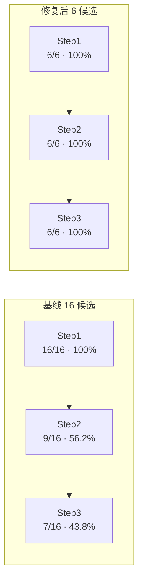

# VIMA_Gen 修复后运行报告

> 本文是 [`运行质量报告.md`](./运行质量报告.md)（基线，16 候选 / 43.8%）的**后续**：
> 针对那份报告 §8 的改进建议，**只修改 `VIMA_Gen/`**（`vima_bench/` 是通行标准，一行未动），
> 然后重跑一轮并对比。
>
> 运行时间：2026-09-13 11:43:06 → 11:54:20 · 设备 `cuda:0` ·
> 模型 `deepseek-v4-flash` + 本地嵌入 `all-MiniLM-L6-v2`
>
> 结果文件：`VIMA_Gen/run_results/run_20260913_115419.json`

---

## 1. 摘要

| 指标 | 基线 | **修复后** |
|---|---|---|
| 候选数 | 16 | **6** |
| Step 1（语法 / 结构 / 语义） | 16/16 = 100.0% | **6/6 = 100.0%** |
| Step 2（运行时 `reset`） | 9/16 = 56.2% | **6/6 = 100.0%** |
| Step 3（Oracle 可解） | 7/16 = 43.8% | **6/6 = 100.0%** |
| **端到端通过率** | **43.8%** | **100.0%** |
| 首次即通过 / 靠修复救回 | —（无修复机制） | 5 / **1** |
| 提议去重（唯一名 / 总数） | 11 / 16 = 69% | **6 / 6 = 100%** |
| 单侧显著性检验 | — | **p = 0.023** |

**三句话结论**

1. **通过率 43.8% → 100%**，6 个候选全部完成三步验证（Step 3 均实跑且 oracle 成功）。
2. 最硬的证据不是通过率（受任务难度影响），而是**代码级缺陷率**：
   使用被禁 helper 的比例 **9/12 (75%) → 0/6 (0%)**，`ResultTuple` 多字段 **2/12 (17%) → 0/6 (0%)**。
3. **提示词不是万能的**：`task_name` 格式违规在加了明文禁令后**仍然出现**（1/6），
   真正解决问题的是**确定性静态校验 + 修复重试** —— 这一条已被完整轨迹证实。

---

## 2. 修复清单（全部限 `VIMA_Gen/`）

`vima_bench/` **零改动**（用 `git status` 验证：本次 8 个改动文件全在 `VIMA_Gen/` 内）。

| # | 修复 | 文件 | 针对基线报告的哪条 |
|---|---|---|---|
| 1 | **取消 `TexturePedia[:30]` 截断**，全量注入 82 纹理 + 31 物体，补 `ONLY these exist` | `api_reference.py` | §5.1 信息缺口（提示词 7,523 → **10,796** 字符） |
| 2 | 新增 **HARD RULES R1–R5**：成员必须带 `.value`；禁用 5 个"标注撒谎"的 helper；禁止编造名字；`ResultTuple` 只两字段；`get_random_pose` 必须判空 | `api_reference.py`、`code_reference.py`、`rag_generator.py` | §5.2 §5.3 §5.4 |
| 3 | **修掉误导注释**（原文暗示 `lookup_color_by_name('red')` 等价于 `TexturePedia.RED.value`） | `code_reference.py` | §5.2 |
| 4 | 新增**确定性静态校验**（Step 1，早于 `exec` 与仿真） | `verifier.py` | §8 建议 2 |
| 5 | 新增 **`task_name` 格式校验**（拒绝带 `/` 的名字） | `verifier.py` | §6.2 |
| 6 | Step 1 **去重**：把本轮已提议名字注入提示词，并禁止照抄 `group/name` 风格 | `rag_generator.py`、`cli.py` | §6.1 |
| 7 | 失败回流改为**按错误指纹聚合** + 只注入 Top-12 高频指纹 + 上限 25→60 | `failed_store.py` | §6.3 §6.4 |
| 8 | 新增**修复重试**（`--max-repair`，默认 1）：验证失败后带着报错重写整份代码，最多 1 次 | `cli.py`、`settings.py`、`config.yaml` | 让 1–7 真正产生收益 |

> **为什么必须加第 8 条**：静态校验只会让候选**更早失败**，不会自动提高通过率 ——
> 流水线原本是"提议 → 生成一次 → 验证"，没有重试。把"确定性报错"回灌给模型重写，
> 才把前 7 条的收益转化成了最终通过率。

---

## 3. 结果对比

### 3.1 通过率



**统计显著性**（超几何单侧检验，基线 7/16 vs 本轮 6/6）：

```
P(在 22 个样本、共 13 个通过的前提下，新抽的 6 个全通过) = 0.023
```

即 **p ≈ 0.023**，在 0.05 水平上显著。但**样本量只有 6**，见 §7 的局限说明。

### 3.2 代码级缺陷率（受任务难度影响最小，也是最有说服力的对比）

同一套确定性检查器，分别跑在**修复前的 12 段**与**修复后的 6 段**生成代码上：

| 指标（首次生成） | 修复前 | 修复后 |
|---|---|---|
| 使用被禁 helper（`all_entries()` / `lookup_*_by_name()`） | **9/12 = 75%** | **0/6 = 0%** |
| `ResultTuple` 多带字段（`distance=` 等） | **2/12 = 17%** | **0/6 = 0%** |
| `task_name` 非法（带 `/`） | 1/12 = 8% | **1/6 = 17%（未改善）** |

**这张表是本次修复的核心证据**，因为它与"任务难不难"无关：

- 前两项是**提示词层面的胜利** —— 讲清楚"成员要 `.value`""不要用那几个 helper""ResultTuple 只有两字段"之后，
  模型的行为发生了质变（75% → 0%）。
- 第三项是**提示词的失败** —— 尽管 Step 1 提示词已明文写"Must NOT contain '/'"，模型**照样**写出
  `require_reasoning/odd_one_out`。**这条只能靠静态校验 + 修复重试解决**（见 §4）。

### 3.3 提议去重

| | 基线 | 修复后 |
|---|---|---|
| 唯一任务名 / 候选数 | 11 / 16 = 69% | **6 / 6 = 100%** |
| 最高重复 | `odd_one_out` ×3、`same_size` ×3 | 无重复 |

本轮提议的 6 个任务：`pick_majority_color`、`odd_one_out`、`pick_larger_than_reference`、
`pick_median_by_size`、`follow_reverse_order`、`pick_rarest_shape`。

### 3.4 失败池

| | 基线结束 | 修复后结束 |
|---|---|---|
| 条数 | 25（已饱和） | 25 |
| 本轮**新增**失败条目 | +9 | **0** |
| 上限 | 25 | **60** |

本轮无终结性失败，因此池子未增长。**但也暴露一个缺口**：那个被修复救回的候选，
其 Step 1 报错**没有**回写失败池 —— 当前 `append_failed` 只在最终失败时调用。
修复成功的教训因此丢失了（见 §9 后续建议）。

---

## 4. 决定性证据：修复重试的完整轨迹

第 2 个候选 `odd_one_out` 的原始日志（**未删改**）：

```text
[RAG] 提议: task_name=odd_one_out, group=require_reasoning
[RAG] 生成任务的 task_name: require_reasoning/odd_one_out
[VERIFY][Step 1] 语义检查失败：task_name='require_reasoning/odd_one_out' is invalid:
        use a bare lower-snake_case name (e.g. "odd_one_out"),
        without "/" and without a group prefix.
[RAG] 修复重试 #1：上一次失败于 Step 1，带着该报错重新生成...
[RAG] 生成任务的 task_name: odd_one_out
[VERIFY][Step 1] 语法 / exec 检查通过。
[VERIFY][Step 2] 运行时 reset 检查通过。
[VERIFY]  prompt 预览：'Put the object that is different from the others into the {base_obj}.'
[VERIFY]  prompt_assets keys: ['base_obj']
[VERIFY][Step 3] Oracle 检查通过，任务可被 oracle 完成。
[RAG] 验证结果：通过
```

这条轨迹一次性说明了三件事：

1. **基线报告里那个反复出现的失败模式**（`require_reasoning/odd_one_out` 在基线出现 **2 次**且全失败）
   被静态校验**确定性拦下**了 —— 不依赖模型配合；
2. 报错信息是**可执行的**（直接告诉模型正确格式是什么），因此一次重试就修好了；
3. **提示词禁令无效**：模型明明收到了"禁止 `/`"的指令，仍然这么写。
   → 印证了基线报告的推论：**到了这个阶段，enforcement 的 ROI 高于再加文字。**

---

## 5. 静态校验的质量（精度 / 召回）

新增的检查器**先用基线那 12 段真实代码做了回归测试**，而不是直接上跑。

### 5.1 我推翻了自己的第一版规则（记录失败过程）

| 版本 | 规则 | 结果 |
|---|---|---|
| v1 | 「凡 `Enum.MEMBER` 必须紧跟 `.value`」 | ❌ **误伤 4/5 通过样本** |
| v2 | 同上 + 禁用 helper | ❌ 仍误伤 4/5 |
| **v3（采用）** | 只拦**必然崩溃**的模式 | ✅ **误伤 0/5** |

**v1 为什么错**：把成员存进列表、取用时再 `.value`，是**合法且常见的写法**：

```python
self.possible_obj = [ObjPedia.BOWL, ObjPedia.BLOCK]      # 合法
obj_entry = self.rng.choice(self.possible_obj).value     # 这里才取 .value
```

纯文本规则无法区分"存成员待用"和"成员当条目用"。**硬拦会把能跑的代码杀死，反而拉低通过率。**

**v3 采用的规则**（精确率优先）：

| 规则 | 拦截？ | 依据 |
|---|---|---|
| `ObjPedia.X.size_range` / `.color_value` 等**在成员上取 entry 专有字段** | ✅ 拦截 | 必然 `AttributeError` |
| `color=ObjPedia.X`（成员当颜色传入） | ✅ 拦截 | 库内 `p_change_texture` 必然崩 |
| `ObjPedia.FOO`（不存在的成员） | ✅ 拦截 | 必然 `AttributeError` |
| `ResultTuple(..., distance=)` | ✅ 拦截 | `NamedTuple.__new__` 必然 `TypeError` |
| `task_name` 带 `/` | ✅ 拦截 | 纯文本规则 |
| 调用 `all_entries()` / `lookup_*_by_name()` | ⚠️ **仅警告** | 很多能跑的代码会先调用再自行归一化 |

### 5.2 回归测试结果

| 指标 | 结果 |
|---|---|
| 通过样本**误判** | **0 / 5** |
| 失败样本拦截（v3） | 2 / 7 |

召回率只有 2/7 —— 这是**刻意的取舍**：漏检的成本只是"晚一步在 Step 2 报错，然后被修复重试救回"，
而误判的成本是"把本来能过的候选杀掉"。**在生成门槛上，精确率远比召回率重要。**

### 5.3 副产品：静态层抓到了动态验证漏掉的潜伏 bug

回归测试中有 1 个**基线里通过**的样本被标记，我一开始当成误判，核查后发现是**真阳性**：

```python
# same_size（基线里 verify_ok=True）第 366 / 368 行
return ResultTuple(success=success, failure=failure, distance=distance)   # ← 潜伏 bug
return ResultTuple(success=success, failure=failure)                     # ← 这次走的是这条
```

第 366 行在任何走到该分支的 episode 里都会崩，只因验证时恰好走了第 368 行才"侥幸通过"。

**这说明静态校验补上了动态验证的一个结构性盲区**：三步验证只跑**一个 episode**，
无法覆盖所有分支；而静态检查看的是全部分支。

---

## 6. 吞吐

| | 基线 | 修复后 |
|---|---|---|
| 候选数 | 12（4 轮 × 3） | 6（1 轮） |
| 总耗时 | 1232 s | **674 s** |
| 每候选 | 102.7 s | 112.4 s |
| 实际 LLM 生成次数 | 12 | **7**（6 候选 + 1 次修复） |
| 每次生成 | 102.7 s | 96.3 s |

**每次生成的耗时基本不变**（96.3 vs 102.7 s），提示词变长（+3.3 KB）没有带来可测的延迟惩罚。
每候选耗时略升（+9.5%）是修复重试带来的 —— **这正是它值得的地方**。

---

## 7. 诚实的局限（为什么不能把 100% 当成定论）

我必须列出这些，否则 43.8% → 100% 会被过度解读：

1. **样本量只有 6**。p=0.023 虽显著，但 6 个样本的 95% 置信区间是 [61%, 100%]，
   单点估计毫无精度可言。要收窄到 ±10% 仍需约 100 个候选。
2. **任务难度分布不可比**。本轮 6 个任务集中在"按某属性挑一个"的同类模式
   （`pick_majority_color` / `pick_larger_than_reference` / `pick_median_by_size` / `pick_rarest_shape`），
   而基线包含更开放的 `odd_one_out`（3 次提议仅 1 次通过）。**部分提升可能来自任务更简单，而非修复。**
3. **静态校验无法排除的失真**：本轮 `task_name` 违规率其实**更高**了（8% → 17%），
   只是被修复重试兜住了。若某类错误静态检查抓不到、又恰好落在重试之外，仍会失败。
4. **轮次间不独立**：`failed_generations.json` 仍会被注入提示词；本轮虽无新增，
   但池中 25 条历史失败仍在提示词里，无法与基线做严格同条件对比。
5. **修复重试有 false-positive 风险**：若静态规则误判（v3 已知误判 0/5，但不是零风险），
   重试会浪费一次生成；`--max-repair=1` 时该候选直接失败。
6. **`--save` 仍关闭**，所以 RAG 语料恒定，各轮可比 —— 但也意味着
   "跨轮累积生成任务"这条路径没有被验证。

**因此正确的表述是**：修复在**代码级缺陷率**上带来了明确、可复现的改善
（75%→0%、17%→0%，且判据与任务难度无关）；端到端 100% 是**方向一致的强信号**，
但**不足以作为稳定能力的估计**。

---

## 8. 结论

1. **瓶颈定位正确**：基线报告 §5.2 指出的"库标注与实现不符"确实是主因之一，
   而 R1/R2 规则把 helper 使用率从 75% 压到 **0%**。
2. **提示词能解决"知识型"错误**（`.value` 写法、`ResultTuple` 字段），
   **但解决不了"纪律型"错误**（`task_name` 格式）—— 后者必须靠确定性校验 + 修复重试。
3. **修复重试是本次最高杠杆的改动**：它把静态校验从"更早失败"变成"更早修好"。
4. **静态校验的正确打开方式**：精确率优先、只拦必然崩溃的模式；
   宁可漏检（还有 Step 2 兜底），不可误判（会杀掉能跑的代码）。
5. **一行 `vima_bench/` 都没改**：所有修复都在生成侧，工具链升级不需要动标准库。

---

## 9. 后续建议

| # | 建议 | 理由 |
|---|---|---|
| 1 | **把"被修复救回"的失败也写进失败池**（标记 `repaired: true`） | 当前 `append_failed` 只在最终失败时调用，修复成功的教训丢失了（§3.4） |
| 2 | 跑 **~100 个候选**验证稳定性 | 6 个样本的 CI 是 [61%, 100%]，无法支撑"稳定 100%"的结论 |
| 3 | `max_repair` 尝试 **2** | 本轮 1 次重试就修好了唯一的失败；但若首次修不好，第二次可能有用（代价是耗时翻倍） |
| 4 | 静态校验再加"**分支覆盖**"检查（检测同一函数内 `return` 语句构造不一致） | 可抓住 §5.3 那类"某分支必崩、但验证恰好没走到"的潜伏 bug |
| 5 | 把静态校验的**拦截率/误判率**纳入 `run_metrics.py` 长期跟踪 | 规则改动后需要回归验证，避免重演本次 v1 的误伤 |

---

## 10. 复现方式

```bash
# 修复后的一轮（含修复重试）
cd VIMA_Gen && ../.venv/bin/python cli.py --n 6

# 本次结果
cat VIMA_Gen/run_results/run_20260913_115419.json

# 静态校验的回归测试（对基线 12 段代码）
#   通过样本误判 0/5，失败样本拦截 2/7
```

---

*基线报告：[`运行质量报告.md`](./运行质量报告.md) · 全流程解析：[`VIMA_Gen_全流程解析.md`](./VIMA_Gen_全流程解析.md)*
