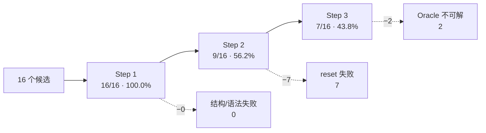

# VIMA_Gen 运行质量报告

> 本报告基于**真实运行**（DeepSeek `deepseek-v4-flash` + 本地嵌入）产出的
> `VIMA_Gen/run_results/run_*.json` 与 `VIMA_Gen/failed_generations.json`，
> 所有数字可用 `python scripts/run_metrics.py` 复现。
>
> 生成时间：2026-09-13 · 设备：`cuda:0`（RTX 5060 Laptop）

---

## 1. 结论摘要

| 指标 | 结果 |
|---|---|
| 样本量 | **16 个候选** / 6 轮 |
| **Step 1**（语法 + 结构） | **16/16 = 100.0%** ｜ 95% CI [80.6%, 100.0%] |
| **Step 2**（运行时 `reset`） | **9/16 = 56.2%** ｜ 95% CI [33.2%, 76.9%] |
| **Step 3**（Oracle 可解） | **7/16 = 43.8%** ｜ 95% CI [23.1%, 66.8%] |
| **端到端通过率** | **43.8%**（= Step 3，因为通过 Step 3 必然通过前两步） |
| 吞吐 | **约 1.7 分钟 / 候选**（102.7 s，含 2 次 LLM 调用 + 完整仿真验证） |

**三句话总结**

1. **语法层面已经完全不是瓶颈**：16/16 生成代码都能 exec 并通过结构检查。
2. **真正的瓶颈在 Step 2（运行时 `reset`）**：通过率掉到 56.2%。
   本轮主因是 `ObjPedia`/`TexturePedia` **库的标注与实现不符**导致调用方踩雷（见 §5.2），
   而不是简单的"模型乱用 API"。
3. **原报告的"最大根因"经 fact-check 后被推翻，取而代之的是一个库级陷阱**：
   ① `api_reference.py` 确实把 `TexturePedia` 清单**截断到前 30 个**（82 条里 17 个纯色名全部不可见），
   但本轮 12 个候选**没有复现**其危害（52 次纹理引用 100% 合法）；
   ② 真正导致本轮失败的是 `ObjPedia`/`TexturePedia` 的
   **`all_entries()` / `lookup_*_by_name()` 标注与实现不符**（标注 `TextureEntry`，实际返回枚举成员）。
   完整核验见 **§5.0**。

---

## 2. 实验设置

| 项 | 值 |
|---|---|
| 对话模型 | `deepseek-v4-flash` @ `https://api.deepseek.com`（OpenAI 兼容） |
| 嵌入后端 | `local:sentence-transformers/all-MiniLM-L6-v2`（离线，跑在 GPU） |
| 检索 | FAISS，`k=5`，语料 = 17 个内置任务 |
| 温度 | 0.7 |
| 设备 | `auto` → `cuda:0`（torch 2.14.0+cu130） |
| 轮次 | 4 轮 × `--n 3` = 12 个候选（另含 1 个单候选校验轮 + 1 个历史轮，共 16 个） |
| `--save` | **关闭** —— 保持 RAG 语料恒定，使各轮可比 |

### 2.1 方法学说明与局限（重要）

- **样本量小**：16 个候选的 95% 置信区间很宽（如 Step 3 的 CI 横跨 23%–67%）。
  本报告给的是**方向性结论**，不是精确的能力评估；要收窄到 ±10% 需要约 100 个候选。
- **轮次间不独立**：`failed_generations.json` 会在**每次失败后追加**，而该文件又被注入下一次
  生成的提示词。因此第 3、4 轮的提示词里已经含有第 1、2 轮的失败教训 —— 这提高了后期轮次的表现
  预期，但也意味着各轮不是独立同分布样本。
- **失败池有损**：`failed_store.py` 设 `MAX_ENTRIES = 25` 且 FIFO 淘汰。本轮结束池子正好**饱和在 25**，
  新失败会挤掉更早的样本。
- **同一任务名会重复出现**，且同样的任务名在不同轮次可能一次通过一次失败（生成是随机的），
  因此不能按任务名聚合成功率。

---

## 3. 三步通过率



**漏斗解读**：全部损失都发生在 Step 2 与 Step 3。Step 2 一次性淘汰 7 个（44%），
Step 3 再淘汰 2 个。提高通过率的关键是**降低 Step 2 的失败**。

### 3.1 逐轮明细

| # | 轮次文件 | 候选 | Step1 | Step2 | Step3 | 提议的任务名 |
|---|---|---|---|---|---|---|
| 1 | `run_20260912_193311.json` | 3 | 3/3 | 1/3 | 1/3 | `odd_one_out`, `require_reasoning/odd_one_out`, `odd_one_out` |
| 2 | `run_20260913_095606.json` | 1 | 1/1 | 1/1 | 1/1 | `same_size` |
| 3 | `run_20260913_100057.json` | 3 | 3/3 | 2/3 | 1/3 | `place_without_touching`, `stack_by_size`, `odd_one_out_selection` |
| 4 | `run_20260913_100533.json` | 3 | 3/3 | 1/3 | 1/3 | `put_in_same_size_container`, `same_size`, `same_color` |
| 5 | `run_20260913_101059.json` | 3 | 3/3 | 2/3 | 1/3 | `pick_largest`, `smallest_into_largest`, `require_reasoning/odd_one_out` |
| 6 | `run_20260913_101659.json` | 3 | 3/3 | 2/3 | 2/3 | `odd_one_out`, `same_size`, `pick_largest_object` |

第 6 轮表现最好（2/3），第 3 轮最差（1/3）；**没有出现明显的学习曲线**，轮次间波动更像随机噪声。

---

## 4. 失败归因

### 4.1 本轮 12 个候选的 9 条失败

| 类别 | 次数 | 占比 |
|---|---|---|
| 幻觉 API 签名 | 3 | 33% |
| 百科条目误用 | 2 | 22% |
| 其他（采样失败 / 越界） | 2 | 22% |
| None 传播 | 1 | 11% |
| Oracle 不可解（Step 3） | 1 | 11% |

### 4.2 历史失败池累计（25 条，已饱和）

| 类别 | 次数 | 占比 |
|---|---|---|
| **百科条目误用** | **10** | **40%** |
| 幻觉 API 签名 | 5 | 20% |
| None 传播 | 4 | 16% |
| Oracle 不可解 | 2 | 8% |
| 代码缺陷 | 2 | 8% |
| 其他 | 2 | 8% |

> ⚠️ **两个视角的样本性质不同**：历史池那 25 条的产生时间、提示词版本与配置**均无法溯源**
> （且池子上限 25、FIFO 淘汰，可能已丢失更早样本）。它只能说明"历史上出现过这些错误"，
> **不能直接归因到当前配置**。本报告 §5 的所有因果关系均已用代码内省 + 本轮实际样本重新核验。

### 4.3 全部 16 个候选明细

| 轮次 | 任务名 | 结果 | 失败步 | 报错摘要 |
|---|---|---|---|---|
| 193311 | `odd_one_out` | ❌ | 2 | `ResultTuple.__new__() got an unexpected keyword argument 'distance'` |
| 193311 | `require_reasoning/odd_one_out` | ❌ | 2 | 同上 |
| 193311 | `odd_one_out` | ✅ | — | — |
| 095606 | `same_size` | ✅ | — | — |
| 100057 | `place_without_touching` | ❌ | 2 | `'>' not supported between instances of 'NoneType' and 'int'` |
| 100057 | `stack_by_size` | ❌ | 3 | `list index out of range` |
| 100057 | `odd_one_out_selection` | ✅ | — | — |
| 100533 | `put_in_same_size_container` | ❌ | 2 | `ResultTuple.__new__() ... 'distance'` |
| 100533 | `same_size` | ✅ | — | — |
| 100533 | `same_color` | ❌ | 2 | `'TexturePedia' object has no attribute 'color_value'` |
| 101059 | `pick_largest` | ✅ | — | — |
| 101059 | `smallest_into_largest` | ❌ | 2 | `'ObjPedia' object has no attribute 'size_range'` |
| 101059 | `require_reasoning/odd_one_out` | ❌ | 3 | `在 10 步内未成功完成任务` |
| 101659 | `odd_one_out` | ❌ | 2 | `Error in sampling a common object` |
| 101659 | `same_size` | ✅ | — | — |
| 101659 | `pick_largest_object` | ✅ | — | — |

**注**：`same_size` 3 次提议 **3 次全部通过** —— 说明「同类尺寸」这类几何关系明确的任务，
模型能稳定产出正确代码；而 `odd_one_out`（"找出与众不同的那个"）3 次提议只过 1 次，
因为它要求模型自己发明「如何判定不同」的判据，属于开放式推理。

---

## 5. 根因分析（含 fact-check）

> 本章在 2026-09-13 用**代码内省 + 实际生成样本**逐条重新核验：
> 用 `inspect` 读取真实成员集合 → 用正则校验 12 段生成代码里的**每一次**百科引用 →
> 在解释器里**复现**每一条报错消息。

### 5.0 fact-check 一览：哪些结论站得住

| # | 原报告结论 | 核验结果 |
|---|---|---|
| 1 | `TexturePedia` 82 条、只注入前 30 | ✅ 属实 |
| 2 | 注入的前 30 条全是花纹纹理 | ✅ 属实 |
| 3 | 纯色名"第 66–81 位" | ⚠️ 数值偏差：实为索引 **65–81**（0-based），共 **17** 个 |
| 4 | `ObjPedia` "31 / 30，被截断" | ❌ **错**：`ObjPedia` 那行是 `", ".join(obj_names)`，**31/31 全量注入，从未截断** |
| 5 | `BROWN`/`GRAY`/`MAGENTA`/`BLACK` 不在 82 条内 | ✅ 属实（4 个实测全部 `False`） |
| 6 | 缺成员 → `AttributeError`，消息为裸名 | ✅ 属实 |
| 7 | 截断**"导致 40% 的失败"** | ❌ **未证实**：本轮 12 个候选共 **52 次**纹理引用，**100% 合法、非法名 0 次、使用被截断名字 0 次** |
| 8 | §5.2 机制＝「把枚举类当成员用」 | ❌ **机制写反**：真因是库的 `all_entries()` / `lookup_*_by_name()` **标注返回 `TextureEntry`/`ObjEntry`，实际返回枚举成员**（见 5.2） |
| 9 | `code_reference.py` 里没有 `ResultTuple` 定义 | ❌ **错**：第 180–197 行有完整 `check_success` 示例 |
| 10 | 提示词没提 `get_random_pose` 可能返回 `None` | ⚠️ 不准确：`code_reference.py:48` 已写明，只是未列为**强制**检查 |
| 11 | 内置任务 `oracle_max_steps` "2–8 步" | ❌ **错**：实际 **3–14 步** |

**修正后的判断**：原先 5 条"根因"里，只有 **① 清单截断**机制成立（但本轮**未能复现其危害**）；
**②** 机制写反了，改正后证据反而更硬；**③④** 把"提示词里已经写了、模型却没遵守"
误判成了"提示词缺失"；**⑤** 的数字错了。下面 5.1–5.6 是修正版。

### 5.1 根因 A：`TexturePedia` 清单被截断（风险成立，本轮未复现）

**这是什么意思** —— 给模型的"可用颜色/纹理白名单"只发了 82 条里的前 30 条，
而前 30 条恰好**全是花纹**（`BRICK`/`TIGER`/`POLKA_DOT`/各种 `*_STRIPE`）。
17 个最常用、最符合直觉的**纯色名**（`RED`/`BLUE`/`GREEN`…）排在**第 65–81 位，一个字都没发出去**。
模型想表达"红色"时，白名单里根本没有 `RED`，只能①凭常识编一个颜色名，或②拿花纹顶替。

`VIMA_Gen/api_reference.py`：

```python
", ".join(obj_names),                                                 # ObjPedia：全量 31 条
", ".join(tex_names[:30]) + (" ..." if len(tex_names) > 30 else ""),  # TexturePedia：只发前 30 条
```

**已证实的事实**

| 事实 | 数值 |
|---|---|
| `TexturePedia` 实际条目 | **82** |
| 注入给模型的 | **30**（36.6%） |
| 注入的这 30 条 | 全是花纹纹理 |
| 17 个纯色名的位置 | 索引 **65–81**（0-based）→ 全部不可见 |
| `ObjPedia` | **31 / 31，未截断**（原报告此处写错） |
| 注入字符串的结尾 | 字面量 `" ..."` —— 模型**知道自己拿到的是残缺清单** |

**未证实的事实**：原报告称截断"导致 40% 的失败"。追查后：
- 那 40% 来自 `failed_generations.json` 里的**历史条目**，其生成时的提示词与配置**无法溯源**；
- 本轮 12 个候选我逐条校验了每次引用 —— **52 次纹理引用全部合法**。

所以它是一个**有充分理论依据、但本轮未复现**的潜在风险，不能算作已量化的损失。

**如果它发作，会有两种后果**（前者可检测，后者不可检测）：

1. **响亮失败** —— 模型编造 `TexturePedia.BROWN` → `AttributeError: 'BROWN'`；
   或走 `lookup_color_by_name("magenta")` → `ValueError: Cannot find provided color magenta`。
   验证器能拦住。（这两条消息我都在解释器里复现过。）
2. **静默语义漂移** —— 模型改用白名单里**看得见的花纹**去凑语义：任务要求"红色物体"，
   代码却写 `TexturePedia.MAGMA`。这种代码**能跑、oracle 可能通过、验证器完全拦不住**，
   但任务语义已经错了。**这是截断最危险的形态**，也是通过率数字反映不出来的。

**修复**：取消 `[:30]` 截断（约 1 KB token），并给 `TexturePedia` 那行补上 `ObjPedia`
已有的 **"only these exist"** 声明（当前 TexturePedia 行只写了
`use ... or .lookup_color_by_name`，没有禁止清单外名字）。

⚠️ 但注意：`BROWN`/`GRAY`/`MAGENTA`/`BLACK` **本来就不在这 82 条里**，
所以**光靠全量注入并不能消除这几个具体报错** —— 它消除的是"信息缺口"，不是"编造"。

### 5.2 根因 B：库 API 的标注与实现不符（★真因，已逐字复现）

**这是什么意思** —— 两个百科类都提供了「列出全部条目」「按名字查条目」的便捷方法。
它们的**类型标注写着返回 `ObjEntry` / `TextureEntry`，但实现返回的却是枚举成员**：

```python
# textures.py:416
@classmethod
def all_entries(cls) -> List[TextureEntry]:
    return [e for e in cls if "dark" not in e.value.name]   # ← 返回 e（成员），不是 e.value

# objects.py:368
@classmethod
def all_entries(cls) -> List[ObjEntry]:
    return [e for e in cls]                                  # ← 同样返回成员

# textures.py:406 / objects.py:372
def lookup_color_by_name(cls, name: str) -> TextureEntry:
    for e in cls:
        if name == e.value.name:
            return e                                         # ← 同样返回成员
```

也就是说：**只要调用方相信标注（直接用返回值），就必然踩雷** ——
条目对象才有的字段（`color_value` / `size_range`）在成员上并不存在：

```python
>>> ObjPedia.BOWL.size_range
AttributeError: 'ObjPedia' object has no attribute 'size_range'
>>> TexturePedia.RED.color_value
AttributeError: 'TexturePedia' object has no attribute 'color_value'
>>> ObjPedia.BOWL.value.size_range            # 调用方必须自己再取一层 .value
SizeRange(low=(0.17, 0.17, 0), high=(0.17, 0.17, 0))
```

报错里的 `'ObjPedia' object` 指的是**枚举成员的实例**（其类型名恰好叫 `ObjPedia`），
**不是"类"** —— 这正是原报告把它误读成"把类当成员用"的原因。

**本轮两个失败的触发行（已定位，与报错逐字对应）**

```python
# smallest_into_largest（222 行）—— 两条路径都产出成员
第  42 行: self.possible_obj = [ObjPedia.BOWL]                     # 成员
第  52 行: resolved_obj.append(ObjPedia.lookup_object_by_name(e))  # 标注说 ObjEntry，实际是成员
第 105 行: obj_entry = self.possible_obj[...]                       # 于是 obj_entry 是成员
第 110 行: low = np.asarray(obj_entry.size_range.low, ...)          # 💥 AttributeError
```

```python
# same_color（329 行）
第  92 行: self.possible_textures = list(TexturePedia.all_entries())  # 标注 TextureEntry，实际是成员
第 185 行: color=pair_texture                                          # 成员被当 TextureEntry 传入
          # → 库内 p_change_texture() 访问 texture_entry.color_value → 💥
```

**额外发现：`code_reference.py` 里有一条会主动误导的提示**

```python
"texture_entry = TexturePedia.RED.value  # 或 TexturePedia.lookup_color_by_name('red')"
```

注释暗示两者等价，但 `lookup_color_by_name('red')` 返回的是**成员**，
直接当 `texture_entry` 用就会崩。

**结论修正**：这条**不能简单归咎于"模型忘了 `.value`"**。
标注与实现不一致是**库自身的陷阱**，而提示词又在旁边给了一条错误的等价建议。
→ 修复应**二选一**：

1. **修库（推荐）**：让 `all_entries` / `lookup_*_by_name` 返回 `e.value`，与标注一致
   —— 但这是**行为变更**，需同步检查所有调用方；
2. **只修文档**：在 `code_reference.py` 明确写出「这四个方法返回的是枚举成员，
   必须自己再取 `.value`」，并删掉那条误导性注释。

### 5.3 根因 C：臆造 `ResultTuple` 字段

**这是什么意思** —— `check_success()` 必须返回只有两个字段的 `ResultTuple`：

```python
class ResultTuple(NamedTuple):   # vima_bench/tasks/task_suite/base.py:29
    success: bool
    failure: bool
```

模型想表达"距离判据"，顺手写了 `ResultTuple(success=..., failure=..., distance=...)`，
`NamedTuple.__new__` 不认第三个关键字 → 立刻失败。本轮出现 **3 次**，是单轮最大一类。

**原报告称"`code_reference.py` 没有把 ResultTuple 写进提示词"—— 这是错的。**
实际第 180–197 行就有完整的典型实现：

```python
"========== check_success 典型实现 ==========",
"def check_success(self, *args, **kwargs) -> ResultTuple:",
"    from vima_bench.tasks.task_suite.base import ResultTuple",
...
"        return ResultTuple(success=True, failure=False)",
```

→ **同样是"提示词写了、模型没遵守"**：它看到了两字段示例，仍自行扩展了字段。

### 5.4 根因 D：`None` 传播

**这是什么意思** —— `BaseTask.get_random_pose()` 在工作空间被占满时会
**返回 `(None, None)`**（`base.py` 里有明确的 `return None, None` 分支），
而手写的采样循环常把这个 `None` 直接拿去做数值比较：

```
'>' not supported between instances of 'NoneType' and 'int'
Failed to sample goal pose for target object
Error in sampling a common object
```

**原报告称"提示词里没提"—— 不准确。** `code_reference.py:48` 已经写了：

```python
"pose = self.get_random_pose(env, obj_size)  # 返回 (pos, quat) 或 (None, None)",
```

只是它躺在"用法清单"里，**没有**升级为"必须判空、否则拒绝采样"的硬性要求。
所以这条**确实还有改进空间**，但性质是"强调不足"，不是"完全没写"。

### 5.5 根因 E：Oracle 不可解 —— 加大步数无效

**这是什么意思** —— Step 3 的判据是"oracle 在 `oracle_max_steps` 内走完且
`info['success']` 为真"。失败样本报「在 10 步 / 12 步内未成功完成」。

原报告称内置任务"只用 2–8 步"，**实测是 3–14 步**：

| `oracle_max_steps` | 任务 |
|---|---|
| 3 | `rotate`, `visual_manipulation`, `novel_adj`, `novel_noun`, `novel_adj_and_noun` |
| 4 | `same_shape`, `same_texture`✦, `manipulate_old_neighbor`, `follow_motion`✦, `follow_order`✦ |
| 5 | `rearrange`, `twist`✦, `pick_in_order_then_restore`✦ |
| 8 | `sweep_without_exceeding`, `rearrange_then_restore` |
| **14** | **`sweep_without_touching`** |
| 动态计算 | `scene_understanding` = 拖拽数 + 2；✦ 另有 `num_frames` / `num_total_objs` / `num_target_base_obj` + 1~2 覆盖 |

→ 所以"生成任务用 10 步、内置最多 8 步"这个论证**不成立**，原报告的数字错了。

**但结论方向仍成立，只需换论证**：不能拿"全局范围"比，要拿**同类任务**比。
失败的是 `odd_one_out`（"把形状与众不同的物体放进容器"），
而**同类的 `visual_manipulation`（"把物体放进容器"）内置只需 3 步**。
一个单次放置任务用 >10 步仍未成功，说明**目标不可达或成功判据写错**，
不是"任务太难、步数不够"。

**修复方向**：不要调大 `oracle_max_steps`；应在 Step 3 失败时输出更有诊断性的信息
（oracle 是否取到了 `pick_mask`、目标位姿是否采样成功等）。
`verifier.py` 已有 `verifier_debug/` 落盘机制可直接利用。

### 5.6 修正后的总体判断

把 5.1–5.5 合起来看，**16 个候选的失败主要不是"信息不够"，而是"模型没遵守已经给出的约束"**：

| 失败类（`run_metrics.py` 分类） | 历史池 | 本轮 | 真正性质 |
|---|---|---|---|
| 百科条目误用 | 10 | 2 | **混合**：裸名幻觉（信息缺口）+ **库标注与实现不符**（`all_entries()` 等返回成员） |
| 幻觉 API 签名 | 5 | 3 | 指令遵从（`code_reference.py` 已给两字段示例） |
| `None` 传播 | 4 | 1 | 强调不足（提示词提了，但非强制） |
| Oracle 不可解 | 2 | 1 | 目标 / 判据设计错误 |
| 代码缺陷 | 2 | 0 | 普通代码错误（如 `list index out of range`） |
| 其他 | 2 | 2 | 采样失败等 |

**推论**：失败的主要来源不是"信息不够"，而是两类**系统性缺陷**：
① **库自身的标注与实现不符**（`all_entries()` / `lookup_*_by_name()`）；
② **模型不遵守已写明的约束**（`ResultTuple` 字段、`get_random_pose` 判空）。

继续往提示词里**加文字**的边际收益已经很低 ——
`.value` 写了 4+ 次、`ResultTuple` 给了完整示例，模型照样错。
更有效的两条路：**修库**、**加确定性静态校验**：

1. 解析代码里每一次 `ObjPedia.X` / `TexturePedia.X` 引用：是否紧跟 `.value`、`X` 是否真实存在；
2. 解析所有 `ResultTuple(...)` 构造：关键字是否只有 `success` / `failure`；
3. 检查 `get_random_pose` 的返回值是否判空后才被使用。

三条都是**纯静态检查**（AST 或正则即可），比"等仿真跑起来再崩"更快也更省算力，
而且能把失败原因直接回灌给下一次生成（`failed_store` 已有该通道）。

---

## 6. 其他质量问题

### 6.1 提议重复率高

16 个候选只产生了 **11 个唯一任务名**：

| 任务名 | 出现次数 |
|---|---|
| `odd_one_out` | 3 |
| `same_size` | 3 |
| `require_reasoning/odd_one_out` | 2 |
| 其余 8 个 | 各 1 |

`propose_new_task()` 的去重**完全依赖提示词里塞入的 17 个内置任务清单**，
既不包含「本轮已提议过的名字」，也不包含 `generated_tasks/` 里已有的名字
（检索器参数 `retriever` 在该函数中**实际未被使用**）。
→ 在 `--n 3` 的同一轮里就可能重复提议。

### 6.2 `task_name` 格式未校验

出现了 `require_reasoning/odd_one_out` 这种带 `/` 的名字 —— 模型把
「`ALL_TASKS` 的 key 格式 `group/task_name`」与「`task_name` 本身」搞混了。
`verify_task_code` 的 Step 1 只检查结构与继承，**不校验 `task_name` 是否为合法 snake_case**。

### 6.3 失败回流效果有限（有实测证据）

`ResultTuple ... 'distance'` 这个错误在**历史池中已存在 2 条**的情况下，
本轮又新增 **3 条**。说明当前把失败样本原文注入提示词的方式，**并不能有效阻止同类错误复发**。
叠加 6.4 的池子饱和问题，回流机制目前更像「记录」而非「抑制」。

### 6.4 失败池有损

`failed_store.py`：`MAX_ENTRIES = 25`、`CODE_SNIPPET_LINES = 35`，FIFO 淘汰。
本轮结束时池子**正好饱和在 25 条**，即新教训会挤掉旧教训。

### 6.5 一个隐蔽的同名陷阱（与本次运行相关）

| 表达式 | 类型 |
|---|---|
| `vima_bench.ALL_TASKS` | **list[str]**（`__init__.py` 里做了 `list(ALL_TASKS.keys())`） |
| `vima_bench.tasks.ALL_TASKS` | **dict[str, type]** |

两者同名、不同型。写分析脚本时极易踩坑（本报告的作者就踩了一次）。
建议在文档中显式标注，或把前者改名为 `ALL_TASK_NAMES`。

---

## 7. 吞吐与耗时

| 轮次 | 候选数 | 耗时 | 平均 |
|---|---|---|---|
| Round 1 | 3 | 269 s | 89.7 s/候选 |
| Round 2 | 3 | 276 s | 92.0 s/候选 |
| Round 3 | 3 | 327 s | 109.0 s/候选 |
| Round 4 | 3 | 360 s | 120.0 s/候选 |
| **合计** | **12** | **1232 s** | **102.7 s/候选** |

- 耗时**几乎全在 LLM 延迟**（Step 2 要生成完整任务类，输出最长）。
- 本地仿真验证（建环境 + oracle 若干步）在 GPU 上仅需数秒；
  `gpu_check.py` 实测 pybullet 256×256 渲染 **0.79 ms/帧**，不是瓶颈。
- 每轮耗时缓慢上升（269 → 360 s），推测与 `failed_generations.json` 注入的失败文本变长有关
  （提示词变长 → 生成变慢）。

---

## 8. 改进建议（按 ROI 排序）

| # | 建议 | 位置 | 预期收益 |
|---|---|---|---|
| 1 | **修库**：让 `all_entries()` / `lookup_object_by_name()` / `lookup_color_by_name()` 返回 `e.value`，与类型标注一致（注意是行为变更，需检查全部调用方） | `vima_bench/tasks/components/encyclopedia/objects.py`、`textures.py` | ★最高：这是本轮 2 条百科失败的真因，且**教训可复用到任何调用方** |
| 2 | **加静态校验**（Step 1）：解析 `ObjPedia.X` / `TexturePedia.X` 引用是否紧跟 `.value`、`X` 是否真实存在；`ResultTuple(...)` 是否只含 `success`/`failure`；`get_random_pose` 返回值是否判空 | `VIMA_Gen/verifier.py` | ★高：本轮 9 条失败里 **6 条**可由确定性规则拦下，不依赖模型配合 |
| 3 | 修 `code_reference.py` 的误导注释：`lookup_color_by_name('red')` **不等于** `TexturePedia.RED.value`（前者返回成员） | `VIMA_Gen/code_reference.py:133` | 消除一条主动把模型带偏的提示 |
| 4 | 把「`get_random_pose` 可能返回 `(None, None)`，**必须**判空重采样」从"用法说明"升级为"强制要求" | `VIMA_Gen/code_reference.py:48` | 已提及，仅需加强措辞 —— 成本极低 |
| 5 | Step 1 去重：把**本轮已提议名字**注入提示词，并校验 snake_case（禁止 `/`） | `VIMA_Gen/rag_generator.py` / `verifier.py` | 降低重复率、消除格式错误 |
| 6 | 失败回流改为**按错误指纹聚合 + 只注入 Top-N 高频指纹**；提高或去掉 `MAX_ENTRIES` | `VIMA_Gen/failed_store.py` | 让回流真正抑制复发 |
| 7 | Oracle 失败时不要只报「步数内未成功」，而是提示检查目标可达性 | `VIMA_Gen/verifier.py` | 提高 Step 3 修复效率 |
| 8 | 文档标注 `ALL_TASKS` 的 list/dict 同名差异 | `doc/`、README | 减少误用 |

> **优先级已按 fact-check 结果重排**：原先把"补提示词"排在最前，但实测表明
> `.value`（提示词里写了 4+ 次）和 `ResultTuple`（给了完整示例）**写了也照样错**，
> 所以"修库 + 加确定性静态校验"的 ROI 明显高于"再加文字"。
> 建议 1–4 都不涉及仿真逻辑，可直接用同样 12 个候选做 A/B 验证。

---

## 9. 复现方式

```bash
# 1) 单轮生成（读 .env + VIMA_Gen/config.yaml）
cd VIMA_Gen && ../.venv/bin/python cli.py --n 3

# 2) 多轮批量
for i in 1 2 3 4; do ../.venv/bin/python cli.py --n 3; done

# 3) 汇总指标（本报告的数字来源）
cd .. && .venv/bin/python scripts/run_metrics.py            # Markdown
.venv/bin/python scripts/run_metrics.py --json             # 机器可读
```

---

## 10. 附录：自动生成指标

以下段落由 `scripts/run_metrics.py` 直接生成，未经人工修饰：

<!-- BEGIN AUTO-GENERATED -->
<!-- END AUTO-GENERATED -->

运行 `python scripts/run_metrics.py --write doc/运行质量报告.md` 可把最新指标追加进本文件。

---

## 11. 附录：生成任务实例

以下代码均来自本轮**真实运行**（`/tmp/vima_batch.log` 的代码预览），**未经改动**，只做节选。
完整生成代码 222–495 行不等。

### 11.1 12 个候选一览

| 任务名 | 代码行数 | 结果 | 失败步 |
|---|---|---|---|
| `place_without_touching` | 351 | ❌ | 2 |
| `stack_by_size` | 277 | ❌ | 3 |
| `odd_one_out_selection` | 495 | ✅ | — |
| `put_in_same_size_container` | 357 | ❌ | 2 |
| `same_size` | 395 | ✅ | — |
| `same_color` | 329 | ❌ | 2 |
| `pick_largest` | 312 | ✅ | — |
| `smallest_into_largest` | 222 | ❌ | 2 |
| `require_reasoning/odd_one_out` | 410 | ❌ | 3 |
| `odd_one_out` | 420 | ❌ | 2 |
| `same_size` | 370 | ✅ | — |
| `pick_largest_object` | 335 | ✅ | — |

### 11.2 ✅ 通过的例子：`pick_largest`

**任务语义**：给定若干尺寸不同的物体，推理出**最大的那个**并放进目标容器。

```python
class PickLargest(BaseTask):
    """Reasoning task: given a set of objects of varying sizes, the agent has
    to reason about their relative sizes, pick the unique largest object and
    place it into the target container.
    """

    task_name = "pick_largest"

    def __init__(
        self,
        # ====== task specific ======
        num_objects: int = 3,
        possible_obj=None,
        possible_obj_texture=None,
        possible_base_obj=None,
        possible_base_obj_texture=None,
        oracle_max_steps: int = 10,
        # ====== general ======
        obs_img_views=None,
        obs_img_size=(128, 256),
        placeholder_img_size=(128, 256),
        seed=None,
        debug=False,
    ):
        assert num_objects >= 2, "Need at least two objects for a size comparison"
```

它**正确地**写对了最易出错的两处脚手架（第 272 / 284 行）：

```python
        self.goals.append(
            (
                [(target_obj_id, (symmetry, None))],   # objs
                np.ones((1, 1)),                       # matches
                [target_pose],                         # targs
                False,                                 # replace
                True,                                  # rotations
                "pose",                                # metric
                None,                                  # params
                1.0,                                   # max_reward
            )
        )
        self._all_goals = self.goals.copy()            # ← 验证器 Step 1 的硬性要求
```

以及**只用两个字段**的 `check_success`：

```python
    def check_success(self, *args, **kwargs) -> ResultTuple:
        all_achieved = len(self.goals) == 0
        if all_achieved:
            return ResultTuple(success=True, failure=False)
```

### 11.3 ❌ 失败例一：`put_in_same_size_container` —— 臆造 `ResultTuple` 字段

同一个 `check_success` 里，模型给它加了第三个字段 `distance`：

```python
# 第 338 行
return ResultTuple(success=True, failure=False, distance=self.pos_eps)

# 第 355 行
return ResultTuple(success=False, failure=is_failure, distance=distance)
```

运行时报：

```text
ResultTuple.__new__() got an unexpected keyword argument 'distance'
```

而 `code_reference.py:180–197` **已经给了两字段的完整示例** ——
属于"看到了正确写法仍然自行扩展"。

### 11.4 ❌ 失败例二：`smallest_into_largest` —— 踩中库的标注陷阱

```python
# 第 42 行：直接放枚举成员（正确应为 ObjPedia.BOWL.value）
self.possible_obj = [ObjPedia.BOWL]

# 第 52 行：调用「按名字查条目」—— 标注说返回 ObjEntry，实际返回成员
resolved_obj.append(ObjPedia.lookup_object_by_name(e))

# 第 105 / 110 行：于是 obj_entry 是成员，取 .size_range 就爆
obj_entry = self.possible_obj[int(self.rng.integers(len(self.possible_obj)))]
low = np.asarray(obj_entry.size_range.low, dtype=np.float32)
```

```text
AttributeError: 'ObjPedia' object has no attribute 'size_range'
```

注意：**同一份代码在别处又写对了** —— 第 77 行 `TexturePedia.all_entries()`、
第 90 行 `lookup_color_by_name(e)` 都被它当成"已经解析好的条目"直接使用。
这正是 §5.2 的要点：**标注与实现不符时，调用方怎么写都有一半概率踩雷。**

### 11.5 失败例三：`same_color` 的触发路径

```python
# 第 92 行
self.possible_textures = list(TexturePedia.all_entries())   # 标注 TextureEntry，实际是成员
# 第 185 行
base_id, base_urdf, base_pose = self.add_object_to_env(
    ...
    color=pair_texture,                                     # 成员被当作 TextureEntry 传入
)
```

→ 库内 `p_change_texture()` 访问 `texture_entry.color_value` → 抛
`AttributeError: 'TexturePedia' object has no attribute 'color_value'`。
