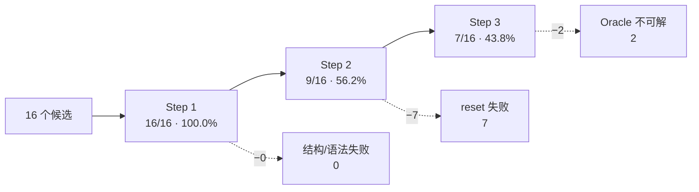

# VIMA_Gen 运行质量报告

> 本报告基于**真实运行**（DeepSeek `deepseek-v4-flash` + 本地嵌入）产出的
> `VIMA_Gen/run_results/run_*.json` 与 `VIMA_Gen/failed_generations.json`，
> 所有数字可用 `python scripts/run_metrics.py` 复现。
>
> 生成时间：2026-09-13 · 设备：`cuda:0`（RTX 5060 Laptop）

---

## 1. 结论摘要

| 指标 | 结果 |
|---|---|
| 样本量 | **16 个候选** / 6 轮 |
| **Step 1**（语法 + 结构） | **16/16 = 100.0%** ｜ 95% CI [80.6%, 100.0%] |
| **Step 2**（运行时 `reset`） | **9/16 = 56.2%** ｜ 95% CI [33.2%, 76.9%] |
| **Step 3**（Oracle 可解） | **7/16 = 43.8%** ｜ 95% CI [23.1%, 66.8%] |
| **端到端通过率** | **43.8%**（= Step 3，因为通过 Step 3 必然通过前两步） |
| 吞吐 | **约 1.7 分钟 / 候选**（102.7 s，含 2 次 LLM 调用 + 完整仿真验证） |

**三句话总结**

1. **语法层面已经完全不是瓶颈**：16/16 生成代码都能 exec 并通过结构检查。
2. **真正的瓶颈在「运行时 set 台」这一步**：Step 2 掉到 56.2%，主要原因是模型**误用百科 API**。
3. **最大单一根因已定位并可一行修复**：`api_reference.py` 把百科清单**截断到前 30 个**，
   导致模型看不到合法的纯色名（`RED`/`BLUE`…）而凭常识编造 `BROWN`/`GRAY`/`MAGENTA`，
   这一类占历史失败池的 **10/25 = 40%**。

---

## 2. 实验设置

| 项 | 值 |
|---|---|
| 对话模型 | `deepseek-v4-flash` @ `https://api.deepseek.com`（OpenAI 兼容） |
| 嵌入后端 | `local:sentence-transformers/all-MiniLM-L6-v2`（离线，跑在 GPU） |
| 检索 | FAISS，`k=5`，语料 = 17 个内置任务 |
| 温度 | 0.7 |
| 设备 | `auto` → `cuda:0`（torch 2.14.0+cu130） |
| 轮次 | 4 轮 × `--n 3` = 12 个候选（另含 1 个单候选校验轮 + 1 个历史轮，共 16 个） |
| `--save` | **关闭** —— 保持 RAG 语料恒定，使各轮可比 |

### 2.1 方法学说明与局限（重要）

- **样本量小**：16 个候选的 95% 置信区间很宽（如 Step 3 的 CI 横跨 23%–67%）。
  本报告给的是**方向性结论**，不是精确的能力评估；要收窄到 ±10% 需要约 100 个候选。
- **轮次间不独立**：`failed_generations.json` 会在**每次失败后追加**，而该文件又被注入下一次
  生成的提示词。因此第 3、4 轮的提示词里已经含有第 1、2 轮的失败教训 —— 这提高了后期轮次的表现
  预期，但也意味着各轮不是独立同分布样本。
- **失败池有损**：`failed_store.py` 设 `MAX_ENTRIES = 25` 且 FIFO 淘汰。本轮结束池子正好**饱和在 25**，
  新失败会挤掉更早的样本。
- **同一任务名会重复出现**，且同样的任务名在不同轮次可能一次通过一次失败（生成是随机的），
  因此不能按任务名聚合成功率。

---

## 3. 三步通过率



**漏斗解读**：全部损失都发生在 Step 2 与 Step 3。Step 2 一次性淘汰 7 个（44%），
Step 3 再淘汰 2 个。提高通过率的关键是**降低 Step 2 的失败**。

### 3.1 逐轮明细

| # | 轮次文件 | 候选 | Step1 | Step2 | Step3 | 提议的任务名 |
|---|---|---|---|---|---|---|
| 1 | `run_20260912_193311.json` | 3 | 3/3 | 1/3 | 1/3 | `odd_one_out`, `require_reasoning/odd_one_out`, `odd_one_out` |
| 2 | `run_20260913_095606.json` | 1 | 1/1 | 1/1 | 1/1 | `same_size` |
| 3 | `run_20260913_100057.json` | 3 | 3/3 | 2/3 | 1/3 | `place_without_touching`, `stack_by_size`, `odd_one_out_selection` |
| 4 | `run_20260913_100533.json` | 3 | 3/3 | 1/3 | 1/3 | `put_in_same_size_container`, `same_size`, `same_color` |
| 5 | `run_20260913_101059.json` | 3 | 3/3 | 2/3 | 1/3 | `pick_largest`, `smallest_into_largest`, `require_reasoning/odd_one_out` |
| 6 | `run_20260913_101659.json` | 3 | 3/3 | 2/3 | 2/3 | `odd_one_out`, `same_size`, `pick_largest_object` |

第 6 轮表现最好（2/3），第 3 轮最差（1/3）；**没有出现明显的学习曲线**，轮次间波动更像随机噪声。

---

## 4. 失败归因

### 4.1 本轮 12 个候选的 9 条失败

| 类别 | 次数 | 占比 |
|---|---|---|
| 幻觉 API 签名 | 3 | 33% |
| 百科条目误用 | 2 | 22% |
| 其他（采样失败 / 越界） | 2 | 22% |
| None 传播 | 1 | 11% |
| Oracle 不可解（Step 3） | 1 | 11% |

### 4.2 历史失败池累计（25 条，已饱和）

| 类别 | 次数 | 占比 |
|---|---|---|
| **百科条目误用** | **10** | **40%** |
| 幻觉 API 签名 | 5 | 20% |
| None 传播 | 4 | 16% |
| Oracle 不可解 | 2 | 8% |
| 代码缺陷 | 2 | 8% |
| 其他 | 2 | 8% |

> 历史池的类别分布比单轮更可信（25 条 vs 9 条），**百科条目误用是第一大失败来源**。

### 4.3 全部 16 个候选明细

| 轮次 | 任务名 | 结果 | 失败步 | 报错摘要 |
|---|---|---|---|---|
| 193311 | `odd_one_out` | ❌ | 2 | `ResultTuple.__new__() got an unexpected keyword argument 'distance'` |
| 193311 | `require_reasoning/odd_one_out` | ❌ | 2 | 同上 |
| 193311 | `odd_one_out` | ✅ | — | — |
| 095606 | `same_size` | ✅ | — | — |
| 100057 | `place_without_touching` | ❌ | 2 | `'>' not supported between instances of 'NoneType' and 'int'` |
| 100057 | `stack_by_size` | ❌ | 3 | `list index out of range` |
| 100057 | `odd_one_out_selection` | ✅ | — | — |
| 100533 | `put_in_same_size_container` | ❌ | 2 | `ResultTuple.__new__() ... 'distance'` |
| 100533 | `same_size` | ✅ | — | — |
| 100533 | `same_color` | ❌ | 2 | `'TexturePedia' object has no attribute 'color_value'` |
| 101059 | `pick_largest` | ✅ | — | — |
| 101059 | `smallest_into_largest` | ❌ | 2 | `'ObjPedia' object has no attribute 'size_range'` |
| 101059 | `require_reasoning/odd_one_out` | ❌ | 3 | `在 10 步内未成功完成任务` |
| 101659 | `odd_one_out` | ❌ | 2 | `Error in sampling a common object` |
| 101659 | `same_size` | ✅ | — | — |
| 101659 | `pick_largest_object` | ✅ | — | — |

**注**：`same_size` 3 次提议 **3 次全部通过** —— 说明「同类尺寸」这类几何关系明确的任务，
模型能稳定产出正确代码；而 `odd_one_out`（"找出与众不同的那个"）3 次提议只过 1 次，
因为它要求模型自己发明「如何判定不同」的判据，属于开放式推理。

---

## 5. 根因分析

### 5.1 根因 A：百科清单被截断 —— 导致 40% 的失败 ★最优先

`VIMA_Gen/api_reference.py` 生成提示词时做了截断：

```python
", ".join(tex_names[:30]) + (" ..." if len(tex_names) > 30 else ""),
```

实测后果：

| 事实 | 数值 |
|---|---|
| `TexturePedia` 实际条目 | **82** |
| 提示词注入给模型的 | **前 30 个** |
| 这 30 个是什么 | 全是花纹纹理（`BRICK`/`TILES`/`TIGER`/`POLKA_DOT`/各种 `*_STRIPE`） |
| 纯色名（`RED`/`BLUE`/`GREEN`…）位置 | **第 66–81 位 → 完全不在提示词里** |
| `ObjPedia` 实际 / 可见 | **31 / 30**（`HANOI_DISK` 被截掉） |

模型看不到任何合法颜色名，于是凭常识编造英文颜色，触发：

```
AttributeError: BROWN     ← 消息就是裸名称
```

已在代码层面验证这条因果链：

```python
>>> TexturePedia.MAGENTA
AttributeError: MAGENTA        # enum 缺成员时 raise AttributeError(name)
```

与失败池中的 `BROWN` / `GRAY` / `MAGENTA` / `BLACK` **逐字节吻合**。
另有 `Cannot find provided color magenta` 来自 `TexturePedia.lookup_color_by_name`（`textures.py:413`），
属同一根因的另一种表现。

**修复**：删掉截断，注入全量 82 + 31 个名字。token 成本约 1 KB，可直接消除最大一类失败。

### 5.2 根因 B：把「枚举类」当成「条目成员」用

```
'TexturePedia' object has no attribute 'color_value'
'ObjPedia'      object has no attribute 'size_range'
```

`color_value` 是 `TextureEntry`（NamedTuple）的字段，`size_range` 是 `ObjEntry` 的字段；
正确写法是**两层访问**：`ObjPedia.BLOCK.value.size_range`、`TexturePedia.RED.value`。

`api_reference.py` 里其实给了正确示例（`ObjPedia.XXX.value`），但模型在「只看得到名字、
看不到结构」的情况下容易退化成 `ObjPedia.size_range`。**根因 A 的修复会同时缓解这一条**
（补全条目后应再补一段「两层访问」的显式强调）。

### 5.3 根因 C：臆造 `ResultTuple` 字段（占比 20%）

```
ResultTuple.__new__() got an unexpected keyword argument 'distance'
<lambda>() got an unexpected keyword argument 'distance'
```

真实定义只有两个字段：

```python
class ResultTuple(NamedTuple):   # vima_bench/tasks/task_suite/base.py:29
    success: bool
    failure: bool
```

模型想表达「距离判据」，就顺手加了 `distance=`。
`code_reference.py` 目前**没有**把 `ResultTuple` 的定义和构造约束写进提示词 —— 这是可补的漏洞。

### 5.4 根因 D：`None` 传播（占比 16%）

```
'>' not supported between instances of 'NoneType' and 'int'
Failed to sample goal pose for target object
Error in sampling a common object
```

源自 `BaseTask.get_random_pose()`：工作空间被占满时它返回 `(None, None)`，
而生成代码直接把这个 `None` 拿去比较/计算。`base.py` 在 `add_object_to_env` 里其实做了判空，
但模型自己写的采样循环往往漏判。

**修复**：在 `code_reference.py` 里把「`get_random_pose` 可能返回 `(None, None)`，
必须判空后重采样」作为**强制检查项**写进提示词。

### 5.5 根因 E：Oracle 不可解 —— 加大步数无效

失败样本报「在 10 步 / 12 步内未成功完成」。但内置任务的真实预算是：

| 任务 | `oracle_max_steps` |
|---|---|
| `rotate` / `novel_adj` / `simple_manipulation` | 3 |
| `manipulate_old_neighbor` | 4 |
| `twist` / `pick_in_order_then_restore` | 5 |
| `rearrange_then_restore` | 8 |
| `scene_understanding` / `pick_in_order_then_restore` | 子目标数 + 2 |

内置任务只用 **2–8 步**（约「子目标数 × 2」，留 1–2 次犯错余量），
而生成任务用 **10–12 步仍失败** → **步数不是瓶颈**，是目标本身不可达或成功判据写错。
继续提高 `oracle_max_steps` 只是浪费仿真时间。

**修复方向**：让提示词要求「先证明目标位姿可采样到」，或在 Step 3 失败时用
`verifier_debug/` 的高度图/掩码给出更精确的反馈（该机制已存在，但需要任务实际失败时才会落盘）。

---

## 6. 其他质量问题

### 6.1 提议重复率高

16 个候选只产生了 **11 个唯一任务名**：

| 任务名 | 出现次数 |
|---|---|
| `odd_one_out` | 3 |
| `same_size` | 3 |
| `require_reasoning/odd_one_out` | 2 |
| 其余 8 个 | 各 1 |

`propose_new_task()` 的去重**完全依赖提示词里塞入的 17 个内置任务清单**，
既不包含「本轮已提议过的名字」，也不包含 `generated_tasks/` 里已有的名字
（检索器参数 `retriever` 在该函数中**实际未被使用**）。
→ 在 `--n 3` 的同一轮里就可能重复提议。

### 6.2 `task_name` 格式未校验

出现了 `require_reasoning/odd_one_out` 这种带 `/` 的名字 —— 模型把
「`ALL_TASKS` 的 key 格式 `group/task_name`」与「`task_name` 本身」搞混了。
`verify_task_code` 的 Step 1 只检查结构与继承，**不校验 `task_name` 是否为合法 snake_case**。

### 6.3 失败回流效果有限（有实测证据）

`ResultTuple ... 'distance'` 这个错误在**历史池中已存在 2 条**的情况下，
本轮又新增 **3 条**。说明当前把失败样本原文注入提示词的方式，**并不能有效阻止同类错误复发**。
叠加 6.4 的池子饱和问题，回流机制目前更像「记录」而非「抑制」。

### 6.4 失败池有损

`failed_store.py`：`MAX_ENTRIES = 25`、`CODE_SNIPPET_LINES = 35`，FIFO 淘汰。
本轮结束时池子**正好饱和在 25 条**，即新教训会挤掉旧教训。

### 6.5 一个隐蔽的同名陷阱（与本次运行相关）

| 表达式 | 类型 |
|---|---|
| `vima_bench.ALL_TASKS` | **list[str]**（`__init__.py` 里做了 `list(ALL_TASKS.keys())`） |
| `vima_bench.tasks.ALL_TASKS` | **dict[str, type]** |

两者同名、不同型。写分析脚本时极易踩坑（本报告的作者就踩了一次）。
建议在文档中显式标注，或把前者改名为 `ALL_TASK_NAMES`。

---

## 7. 吞吐与耗时

| 轮次 | 候选数 | 耗时 | 平均 |
|---|---|---|---|
| Round 1 | 3 | 269 s | 89.7 s/候选 |
| Round 2 | 3 | 276 s | 92.0 s/候选 |
| Round 3 | 3 | 327 s | 109.0 s/候选 |
| Round 4 | 3 | 360 s | 120.0 s/候选 |
| **合计** | **12** | **1232 s** | **102.7 s/候选** |

- 耗时**几乎全在 LLM 延迟**（Step 2 要生成完整任务类，输出最长）。
- 本地仿真验证（建环境 + oracle 若干步）在 GPU 上仅需数秒；
  `gpu_check.py` 实测 pybullet 256×256 渲染 **0.79 ms/帧**，不是瓶颈。
- 每轮耗时缓慢上升（269 → 360 s），推测与 `failed_generations.json` 注入的失败文本变长有关
  （提示词变长 → 生成变慢）。

---

## 8. 改进建议（按 ROI 排序）

| # | 建议 | 位置 | 预期收益 |
|---|---|---|---|
| 1 | **取消百科清单截断**，注入全量 `ObjPedia`(31) + `TexturePedia`(82) | `VIMA_Gen/api_reference.py` | 直接消除 **40%** 的失败（最大项） |
| 2 | 把 `ResultTuple` 定义 + 「禁止自定义字段」写进提示词 | `VIMA_Gen/code_reference.py` | 消除 20% 的失败 |
| 3 | 强调 `ObjPedia.<NAME>.value` / `TexturePedia.<NAME>.value` 的**两层访问**，并声明 `ObjPedia` 本身不是条目 | `VIMA_Gen/code_reference.py` | 消除 class/member 误用 |
| 4 | 把「`get_random_pose` 可能返回 `(None, None)`，必须判空重采样」列为强制检查 | `VIMA_Gen/code_reference.py` | 消除 16% 的失败 |
| 5 | Step 1 去重：把**本轮已提议名字**注入提示词，并校验 snake_case（禁止 `/`） | `VIMA_Gen/rag_generator.py` / `verifier.py` | 降低重复率、消除格式错误 |
| 6 | 失败回流改为**按错误指纹聚合 + 只注入 Top-N 高频指纹**；提高或去掉 `MAX_ENTRIES` | `VIMA_Gen/failed_store.py` | 让回流真正抑制复发 |
| 7 | Oracle 失败时不要只报「步数内未成功」，而是提示检查目标可达性 | `VIMA_Gen/verifier.py` | 提高 Step 3 修复效率 |
| 8 | 文档标注 `ALL_TASKS` 的 list/dict 同名差异 | `doc/`、README | 减少误用 |

> 建议 1–4 都是**纯提示词/文本层面的改动**，不涉及仿真逻辑，风险低、可立即验证：
> 重跑 12 个候选比较 Step 2/3 通过率即可。

---

## 9. 复现方式

```bash
# 1) 单轮生成（读 .env + VIMA_Gen/config.yaml）
cd VIMA_Gen && ../.venv/bin/python cli.py --n 3

# 2) 多轮批量
for i in 1 2 3 4; do ../.venv/bin/python cli.py --n 3; done

# 3) 汇总指标（本报告的数字来源）
cd .. && .venv/bin/python scripts/run_metrics.py            # Markdown
.venv/bin/python scripts/run_metrics.py --json             # 机器可读
```

---

## 10. 附录：自动生成指标

以下段落由 `scripts/run_metrics.py` 直接生成，未经人工修饰：

<!-- BEGIN AUTO-GENERATED -->
<!-- END AUTO-GENERATED -->

运行 `python scripts/run_metrics.py --write doc/运行质量报告.md` 可把最新指标追加进本文件。
